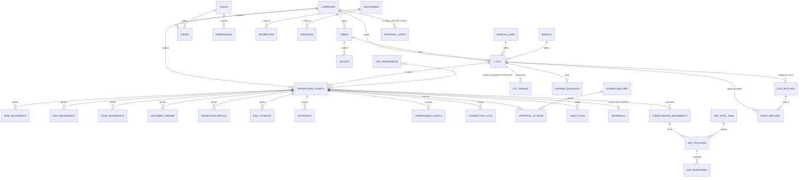

# 12 — MODELO DE DATOS Y BASE DE DATOS

## 1. Características generales

| Aspecto | Valor | Evidencia |
|---|---|---|
| Motor | PostgreSQL (15 en CI; versión de producción NO VERIFICABLE) | `.github/workflows/backend-ci.yml:19` |
| Acceso | SQLAlchemy 2 async + asyncpg; pool 20 + overflow 10 | `backend/app/database.py:7-12` |
| Migraciones | Alembic, **21 revisiones**, **1 head** (`i9j0k1l2m3n4`), **1 base** (`0c661168cb12`), 1 merge | verificado con `ScriptDirectory` |
| Tablas | **47** | `Base.metadata` |
| IDs | `Integer` autoincremental en 46 tablas; `audit_logs.id` es `String(36)` con UUID4 generado en Python | `audit/models.py` |
| Timestamps | `created_at` / `updated_at` con `server_default=now()` y `onupdate` | generalizado |
| Borrado lógico | `is_active` en maestros; `EventStatus.CANCELLED` en eventos | BR-10 |
| SQL crudo | **ninguno** — 100 % ORM (sin superficie de inyección SQL) | búsqueda de `text(` / `execute("` |

## 2. Sincronización modelos ↔ migraciones — VERIFICADA

Comparación programática entre `Base.metadata` (importando los 8 módulos de modelos) y el esquema derivado de las funciones `upgrade()` de las 21 migraciones:

```
Tablas en modelos ................................... 47
Tablas creadas por migraciones ...................... 47
Tablas en modelos sin migración ..................... 0
Tablas en migraciones sin modelo (huérfanas) ........ 0
Columnas en modelos ausentes en migraciones ......... 0
Columnas en migraciones ausentes en modelos ......... 0
```

**Cero deriva de esquema.** Es el punto más sólido del proyecto y contrasta con el resto de hallazgos. La causa de los `UndefinedColumnError` documentados en `AUDITORIA_FUNCIONAL_E2E.md` H1 no fue deriva de código, sino **migraciones no aplicadas en el servidor** (ver INF-02).

## 3. Inventario de tablas

| # | Entidad | Tabla | Propósito | Cols | FK | Módulo | Migración | Uso real |
|---|---|---|---|---|---|---|---|---|
| 1 | Company | `companies` | Empresa (multi-tenant) + `approval_levels` + `sap_config` | 10 | 0 | masters | `b53bbe02a476` | ✔ |
| 2 | Role | `roles` | Roles del sistema | 6 | 0 | auth | `0c661168cb12` | ✔ |
| 3 | Permission | `permissions` | Permiso módulo·acción·alcance | 7 | 1 | auth | `0c661168cb12` | ⚠ **solo para derivar super admin** |
| 4 | User | `users` | Usuarios + `view_type` | 14 | 1 | auth | `0c661168cb12` + `748464484981` | ✔ |
| 5 | Farm | `farms` | Granjas | 8 | 1 | masters | `b53bbe02a476` | ✔ |
| 6 | House | `houses` | Galpones + `capacity` | 7 | 1 | masters | `b53bbe02a476` | ✔ |
| 7 | Hatchery | `hatcheries` | Plantas de incubación | 7 | 1 | masters | `b53bbe02a476` | ✔ |
| 8 | Incubator | `incubators` | Incubadoras | 6 | 1 | masters | `b53bbe02a476` | ✔ (sin UI de admin) |
| 9 | Hatcher | `hatchers` | Nacedoras | 6 | 1 | masters | `b53bbe02a476` | ✔ (sin UI de admin) |
| 10 | GeneticLine | `genetic_lines` | Líneas genéticas | 8 | 1 | masters | `b53bbe02a476` | ✔ |
| 11 | Breed | `breeds` | Razas | 7 | 1 | masters | `b53bbe02a476` | ✔ |
| 12 | ProductivePhase | `productive_phases` | Fases productivas | 9 | 0 | masters | `b53bbe02a476` | ⚠ **CRUD huérfano** |
| 13 | Supplier | `suppliers` | Proveedores + `sap_code` | 8 | 1 | masters | `b53bbe02a476` | ✔ |
| 14 | FeedType | `feed_types` | Tipos de alimento | 7 | 1 | masters | `b53bbe02a476` | ✔ |
| 15 | Vaccine | `vaccines` | Vacunas | 9 | 1 | masters | `b53bbe02a476` | ✔ |
| 16 | Medication | `medications` | Medicamentos | 7 | 1 | masters | `b53bbe02a476` | ✔ (sin UI de admin) |
| 17 | MortalityCause | `mortality_causes` | Causas de mortalidad | 6 | 1 | masters | `b53bbe02a476` | ✔ |
| 18 | CullCause | `cull_causes` | Causas de descarte | 6 | 1 | masters | `b53bbe02a476` | ✔ (sin UI de admin) |
| 19 | Transport | `transports` | Transportes | 8 | 1 | masters | `b53bbe02a476` | ✔ |
| 20 | ProcessingPlant | `processing_plants` | Plantas de beneficio | 6 | 1 | masters | `b53bbe02a476` | ✔ |
| 21 | RejectionReason | `rejection_reasons` | Motivos de rechazo | 7 | 1 | masters | `b53bbe02a476` | ⚠ **CRUD huérfano** |
| 22 | CorrectionType | `correction_types` | Tipos de corrección | 6 | 1 | masters | `b53bbe02a476` | ✔ (leído en CorrectionForm) |
| 23 | Lot | `lots` | **Lote productivo** — `bird_type`, `sex`, `status`, `activation_type`, `hatchery_purpose` | 16 | 5 | masters | `b53bbe02a476` + `a1b2c3d4e5f6` + `h8i9j0k1l2m3` | ✔ |
| 24 | LotPhase | `lot_phases` | Fases del lote (cría/producción) | 10 | 2 | lots | `ad12f3f3ad19` | ✔ |
| 25 | OpeningBalance | `opening_balances` | Saldos iniciales de activación manual | 22 | 3 | lots | `ad12f3f3ad19` | ⚠ **sin UI** |
| 26 | **OperationalEvent** | `operational_events` | **Evento operativo unificado (25 tipos)** | 32 | 15 | operations | `7922512fdef4` + 5 más | ✔ |
| 27 | BirdMovement | `bird_movements` | Movimiento de aves (sexo, cantidad, peso, semana) | 9 | 4 | operations | `7922512fdef4` | ✔ |
| 28 | EggMovement | `egg_movements` | Movimiento de huevos por tipo | 9 | 1 | operations | `7922512fdef4` | ✔ |
| 29 | FeedMovement | `feed_movements` | Consumo de alimento | 7 | 2 | operations | `7922512fdef4` | ✔ |
| 30 | HatcheryParams | `hatchery_params` | Parámetros de incubación | 11 | 4 | operations | `7922512fdef4` | ✔ |
| 31 | InspectionDetail | `inspection_details` | Detalle de inspección por galpón/parámetro | 7 | 2 | operations | `7922512fdef4` + `d2e3f4a5b6c7` + `e5f6a7b8c9d0` | ✔ |
| 32 | EggStorage | `egg_storage` | Almacenamiento de huevo | 12 | 2 | operations | `4396a2b7e7d6` | ⚠ **solo escritura, sin lectura** |
| 33 | Evidence | `evidences` | Adjuntos de evidencia | 11 | 3 | operations | `bfcc893f581a` | ✔ (sin persistencia física) |
| 34 | OperationalAlert | `operational_alerts` | Alertas por desviación | 13 | 4 | operations | `bfcc893f581a` | ✔ |
| 35 | **Reversal** | `reversals` | Reverso post-SAP (BR-16) | 9 | 4 | operations | `bfcc893f581a` | ✘ **TABLA HUÉRFANA — 0 referencias en todo el código** |
| 36 | ReviewBatch | `review_batches` | Lote de revisión | 11 | 2 | review | `e4c4cc5420de` | ✔ |
| 37 | ApprovalAction | `approval_actions` | Acción de revisión/aprobación | 8 | 4 | review | `e4c4cc5420de` | ✔ |
| 38 | ApprovalStep | `approval_steps` | Configuración de nivel de aprobación | 10 | 2 | review | `e4c4cc5420de` | ⚠ **CRUD sin enforcement ni UI** |
| 39 | CorrectionLog | `correction_logs` | Corrección auditada campo a campo | 9 | 3 | corrections | `e4c4cc5420de` | ✔ (no aplica el valor) |
| 40 | SapReference | `sap_references` | Referencias importadas de SAP | 12 | 2 | sap | `397a95b7e826` | ✔ |
| 41 | ConsolidatedMovement | `consolidated_movements` | Movimiento consolidado para SAP | 13 | 3 | sap | `397a95b7e826` | ✔ |
| 42 | SapSyncJob | `sap_sync_jobs` | Trabajo de sincronización | 12 | 2 | sap | `397a95b7e826` | ✔ |
| 43 | SapPayload | `sap_payloads` | Payload enviado + idempotencia + reintentos | 17 | 1 | sap | `397a95b7e826` | ✔ |
| 44 | SapResponse | `sap_responses` | Respuesta de SAP | 8 | 1 | sap | `397a95b7e826` | ✔ |
| 45 | AuditLog | `audit_logs` | **Bitácora inmutable** (21 acciones, valores antes/después) | 21 | 5 | audit | `ee30bd1aa374` | ✔ (con duplicados) |
| 46 | EggBatch | `egg_batches` | Trazabilidad huevo: lote origen → incubadora | 12 | 4 | lots | `f1e2d3c4b5a6` + `g7h8i9j0k1l2` | ⚠ auto-creación rota |
| 47 | ChickBatch | `chick_batches` | Trazabilidad pollito: incubadora → destino | 13 | 6 | lots | `f1e2d3c4b5a6` + `g7h8i9j0k1l2` | ⚠ auto-creación rota |

### Tablas problemáticas

| Tabla | Problema | Impacto |
|---|---|---|
| `reversals` | **0 referencias fuera de la definición del modelo.** BR-16 ("todo ajuste post-SAP se hace por reverso") no tiene implementación. | Requisito no funcional operativamente |
| `permissions` | Se puebla por seeds y solo se lee para deducir `is_super_admin`. | RBAC decorativo (P0) |
| `approval_steps` | 5 endpoints CRUD; `ApprovalService.approve()` nunca la consulta. | Aprobación multinivel no operativa |
| `opening_balances` | 22 columnas, endpoint funcional, **sin pantalla**. | Implantación de lotes en curso imposible desde la UI |
| `egg_storage` | Se escribe desde `create_event`; ningún endpoint la lee. | Datos capturados y no explotados |
| `egg_batches` / `chick_batches` | Auto-creación con emparejamiento por el mismo `lot_id`. | Trazabilidad generacional inoperante |

## 4. Modelo de dominio (ER de entidades centrales)



### Cadena generacional prevista

```
Lote GRANDPARENT (abuelas)
   └─1:N─▶ egg_dispatch ──[EggBatch]──▶ Lote HATCHERY
Lote BREEDER (reproductoras, fase producción)
   └─1:N─▶ egg_dispatch ──[EggBatch]──▶ Lote HATCHERY
Lote HATCHERY
   └─1:N─▶ chick_dispatch ──[ChickBatch]──▶ Lote BROILER | BREEDER
```
Implementación real: rota en modo automático (§6 de `06_PROCESS_COVERAGE.md`).

## 5. Máquinas de estado

### 5.1 `EventStatus` — 13 estados

```
DRAFT
  └─▶ REGISTERED ──submit──▶ PENDING_REVIEW ──start_review──▶ IN_REVIEW
                                                   ├──return──▶ RETURNED ──▶ (edición del operador)
                                                   ├──correction──▶ CORRECTED
                                                   └──complete──▶ CORRECTED (multinivel)
                                                                 └──▶ APPROVED (1 nivel, SIN BR-14)
      CORRECTED ──approve──▶ APPROVED ──consolidate──▶ CONSOLIDATED ──export──▶ SENT_TO_SAP
                └──reject──▶ REJECTED                                    ├──▶ SAP_CONFIRMED
      cualquiera ──cancel──▶ CANCELLED                                   └──▶ SAP_ERROR
```

Inconsistencias detectadas:

| Problema | Detalle |
|---|---|
| **`DRAFT` inalcanzable** | El modelo lo define como valor por defecto, pero `create_event` fuerza siempre `REGISTERED`. Ningún endpoint crea borradores. `MyPendingPage` filtra por `draft,registered`. |
| **`SAP_CONFIRMED` inalcanzable** | Ningún código asigna ese estado. `ManualSapAdapter` deja los eventos en `SENT_TO_SAP` para siempre. |
| **`SAP_ERROR` inalcanzable** | Los fallos se marcan en `SapPayload.status`, no en el evento. |
| **`RETURNED` sin salida definida** | El operador puede editar (`update_event` lo permite) pero no hay transición explícita `RETURNED → PENDING_REVIEW`; debe volver a llamar a `submit`. |
| **Salto de nivel** | `complete_review` con `approval_levels ≤ 1` salta de `IN_REVIEW` a `APPROVED` sin pasar por `CORRECTED` **ni validar segregación**. |
| **Aprobación desde `IN_REVIEW`** | `_get_event_for_approval` acepta `CORRECTED` **o** `IN_REVIEW`, lo que permite saltarse la fase de corrección en flujos multinivel. |

### 5.2 `LotStatus`

`ACTIVE → CLOSED` / `CANCELLED` (valores del enum: `active`, `closed`, `cancelled`). `close_lot` exige `status == active` y aplica BR-05. La UI de cierre está en una pantalla rota.

### 5.3 Consistencia de nomenclatura de estados FE / BE / DB / spec

| Concepto | Spec | Backend/DB | Frontend | ¿Coherente? |
|---|---|---|---|---|
| Aprobado | "Aprobado" | `approved` | `t('status.approved')` | ✔ |
| Pendiente de revisión | "Enviado a Revisión" | `pending_review` | `pending_review` | ✔ |
| Corregido | "Corregido" | `corrected` | `corrected` | ✔ |
| Etapa productiva | 5 dominios (§4.4-4.8) | `BirdTypeEnum` 4 valores + `LotPhase` | **6 `StageKey`** | ✘ **divergente** |
| Clasificación de huevo | `egg_classification` | enum lo conserva | eliminado del catálogo; existe `egg_reception_classification` | ✘ **divergente** |

**No se detectó ningún caso del patrón "APROBADO/approved/ACTIVE/CONFIRMADO"**: la nomenclatura de estados de registro es coherente en las cuatro capas. La divergencia real está en la **taxonomía de etapas y tipos de evento**.

## 6. Integridad, índices y rendimiento

| Aspecto | Estado | Detalle |
|---|---|---|
| Claves foráneas | **fuertes** — 15 FK solo en `operational_events` | ✔ |
| Restricciones únicas | **2** en 47 tablas: `companies.name` y `operational_events.idempotency_key` | ⚠ falta `UNIQUE(company_id, lot_code)` en `lots`, `UNIQUE(company_id, code)` en granjas/galpones |
| Índices | **66 índices** (105 claves foráneas en total); buena cobertura en `audit_logs` (9), `sap_payloads` (4), `sap_references` (3) | ✔ |
| Índices de multi-tenant | añadidos explícitamente por `4982c3092c14` sobre las tablas maestras | ✔ |
| `CHECK` constraints | **ninguno** | cantidades negativas solo se impiden en Pydantic/zod |
| Transacciones | una por request (`get_db` con commit/rollback) | ✔ |
| N+1 | **riesgo alto** en `OperationalEvent`: **8 relaciones con `lazy="selectin"`**; `GET /operations?limit=100` dispara ~9 consultas y materializa todos los submovimientos | ⚠ |
| Consultas pesadas | `_get_mortality_trend` agrupa 8 semanas con `extract()` sin índice funcional sobre `event_date` | ⚠ |
| Paginación | presente en todos los listados; **el conteo total falta en maestros, lots, operations y users** | ⚠ |
| Bucles con consultas | `batch_approve` / `batch_reject` invocan `approve()` en bucle → 1 SELECT + 2 INSERT por evento | ⚠ |
| Cascadas de borrado | no definidas; el borrado es lógico, así que no aplica | ✔ |

## 7. Migraciones sin spec (§61) — `UNTRACED_SCHEMA_CHANGE`

Para cada migración se buscó el requisito y la spec que la autorizan.

| Migración | Cambio | Requisito / spec | Clasificación |
|---|---|---|---|
| `0c661168cb12` initial_schema | roles, permissions, users | spec §4.1 | trazada (baseline) |
| `b53bbe02a476` add_masters | 19 catálogos + lots | spec §4.2 | trazada |
| `ad12f3f3ad19` lot_phases + opening_balances | fases y saldos | spec §4.5/§4.9 | trazada |
| `7922512fdef4` operational_events | evento unificado + 5 submodelos | spec §4.4-4.8 | trazada |
| `e4c4cc5420de` review + corrections | review_batches, approval_actions, approval_steps, correction_logs | spec §4.10 | trazada |
| `397a95b7e826` sap tables | 5 tablas SAP | spec §4.3 | trazada |
| `ee30bd1aa374` audit_log | audit_logs | spec §4.11 | trazada |
| `748464484981` view_type en users | vista móvil/web | spec §6 | trazada |
| `4396a2b7e7d6` egg_storage + seguimiento semanal | **egg_storage** | **ninguna** | **UNTRACED_SCHEMA_CHANGE** |
| `bfcc893f581a` evidences, alerts, reversals, sap | **3 tablas nuevas** | **ninguna** (BR-16 menciona el reverso, no la tabla) | **UNTRACED_SCHEMA_CHANGE** |
| `a1b2c3d4e5f6` BirdTypeEnum.HATCHERY | tipo de lote incubadora | **T-069 (2026-06-24 02:55)** | **trazada — spec-first** |
| `f1e2d3c4b5a6` egg_batches + chick_batches | trazabilidad generacional | T-083 (tarea previa) / spec §4.9 posterior | trazada por tarea, **CODE_BEFORE_SPEC** para la spec |
| `c1d2e3f4a5b6` operation_specific_fields | 14 columnas nuevas en `operational_events` | **ninguna** | **UNTRACED_SCHEMA_CHANGE** |
| `d2e3f4a5b6c7` house_id en inspection_details | inspección por galpón | **ninguna** | **UNTRACED_SCHEMA_CHANGE** |
| `e5f6a7b8c9d0` value_numeric en inspection_details | datos numéricos | **ninguna** | **UNTRACED_SCHEMA_CHANGE** |
| `f6a7b8c9d0e1` idempotency_key | BR-12 | spec BR-12 | trazada |
| `g7h8i9j0k1l2` generalizar chick_batches | destino no solo broiler | **ninguna** | **UNTRACED_SCHEMA_CHANGE** |
| `h8i9j0k1l2m3` hatchery_purpose en lots | propósito de incubación | **ninguna** | **UNTRACED_SCHEMA_CHANGE** |
| `4982c3092c14` índices company_id | rendimiento multi-tenant | **ninguna** (mejora justificada) | **UNTRACED_SCHEMA_CHANGE** (JUSTIFIED) |
| `c574733bab64` merge | resolución de ramas paralelas | — | operativa |
| `i9j0k1l2m3n4` lot_id nullable | inspecciones sin lote | **ninguna** | **UNTRACED_SCHEMA_CHANGE** |

**Resultado: 9 de 21 migraciones (43 %) modifican el esquema sin requisito ni spec que las autorice.** Una de ellas (`i9j0k1l2m3n4`) **relaja una restricción de integridad** (`operational_events.lot_id` pasa a nullable) sin decisión documentada.
