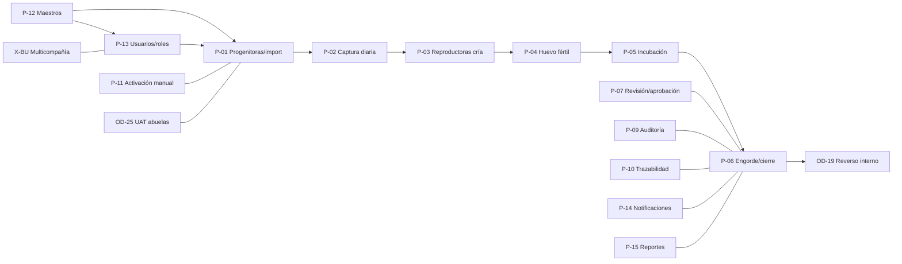

# GA · PRE-SAP — GRAFO DE DEPENDENCIAS DE PROCESOS (TRANCHE 0 · §23/§30)

Inventario: 18 entradas (P-01…P-15 + OD-19 + OD-25 + X-BU). Estado de certificación en HEAD: **0/17 FUNCTIONALLY_CERTIFIED_E2E** (P-08 fuera de alcance pre-SAP). Este grafo define el **orden de recertificación** y las precondiciones de datos de cada proceso.

## 1 · Dependencias funcionales (precondición → proceso)

| Proceso | Nombre | Precondición (proceso/dato) | Corazón técnico | Estado actual |
|---|---|---|---|---|
| P-12 | Datos maestros | — (raíz de datos: empresas, granjas, galpones, razas, curvas, catálogos) | Masters CRUD | BROKEN (R-196: alta estructural rota; 20/21 solo-URL) |
| P-13 | Usuarios, roles y permisos | P-12 (empresas) | Auth/roles | BROKEN (R-199/200/202/195; R-122) |
| P-01 | Progenitoras (importación y cría; recepción de aves autocreadas) | P-12, P-13 | Import/población + recepción | BROKEN (R-190 ubicación; R-193 BR-18; GA-F01/R-189 UAT pendiente) |
| P-02 | Control de producción diario (captura operativa) | P-01 (lotes activos) | Eventos diarios | BROKEN (R-194 parcial, R-206, R-210, R-146, R-198) |
| P-03 | Reproductoras — cría | P-01/P-02 | Cadena cría + curvas | BROKEN (BR-20 navegación R-205; curvas) |
| P-04 | Reproductoras — huevo fértil | P-03 | Producción huevo fértil | BROKEN (R-194 cadena incubadora; R-204 KPIs) |
| P-05 | Incubación | P-04 | Carga/nacimiento/dispatch | BROKEN (BR-21/BR-04 fixtures; R-194) |
| P-06 | Engorde (pollo de engorde y cierre) | P-05 | Engorde + cierre | PARTIAL (R-192 cierre tras reverso; R-144 FCR/peso) |
| P-07 | Revisión, corrección y aprobación | transversal (P-01…P-06) | Review/approvals | PARTIAL (R-197; R-208; R-142; P1-13) |
| P-09 | Auditoría interna | transversal | Audit log | PARTIAL (P1-12 duplicada; R-148; R-83) |
| P-10 | Trazabilidad generacional | P-03/P-04/P-05/P-06 | Enlaces generacionales | UNKNOWN (5 E2E rojos BR-21) |
| P-11 | Activación manual de lotes | P-01/P-12 | Lot activation | BACKEND_ONLY (sin UI; P1-15; R-191 fase) |
| P-14 | Notificaciones | transversal | SLA/recipients | PARTIAL |
| P-15 | Reportes e indicadores | P-01…P-06 | KPIs/IPE | PARTIAL (R-204; Wave C R-131…134; R-218; N-3) |
| X-BU | Multicompañía (BU ON/OFF, aislamiento) | P-12/P-13 | Tenancy | BROKEN (evidencia histórica degradada; GA-UAT-08) |
| OD-19 | Reverso interno | P-06/P-07 | Reversals | BACKEND_ONLY (sin UI; R-207; R-136) |
| OD-25 | Decisión abuelas/aprobación (UAT-09) | P-01 | Import/lot auto | UAT_PENDING (R-153/R-189) |
| P-08 | Integración SAP | (todo) | SAP | **FUERA DE ALCANCE PRE-SAP** (BLOCKED_EXTERNAL; 0 READY) |

## 2 · DAG de procesos y orden de recertificación (T12)

**Orden de certificación E2E (T12)**: P-12 → P-13 → X-BU → P-01 → P-02 → P-03 → P-04 → P-05 → P-06 → P-07 → P-09 → P-10 → P-11 → P-14 → P-15 → OD-19 → OD-25. Cada recertificación exige: artefacto de corrida (log + commit), runtime paridad, y para OD-25/GA-UAT-09 la decisión del propietario.

## 3 · Proceso ↔ tranches de remediación

| Proceso | Tranches que lo desbloquean | Estado esperado tras T1-T11 |
|---|---|---|
| P-12 | T9 (R-196), T3 (R-203) | Reparado |
| P-13 | T2 (R-199/200/202), T9 (R-195), T11 (R-213/R-212) | Reparado |
| X-BU | T2/T3 (alcance) | Reparado y con evidencia |
| P-01 | T4 (R-190), T7 (R-193), T13 (UAT-09/R-189) | Reparado + UAT |
| P-02 | T5 (R-206/209/210), T8 (R-198) | Reparado |
| P-03 | T4 (R-205), T7 (R-211), T11 (R-220 ítem móvil) | Reparado |
| P-04 | T6 (R-194), T3 (R-204) | Reparado |
| P-05 | T6 (R-194), T5 (BR-21 payload) | Reparado |
| P-06 | T7 (R-192), decisión AOD-08/10 (Wave C) | Reparado + decisión |
| P-07 | T2 (R-208), T10 (R-197/R-207/R-142) | Reparado |
| P-09 | T8 (P1-12/R-198/R-219) | Reparado |
| P-10 | T5/T6 (payload/cadena) | Reparado |
| P-11 | T5 (R-191), T11 (P1-15/RES-02 UI activación, si se decide) | Reparado o backend-only aceptado por el propietario |
| P-14 | Sin hallazgo bloqueante; recertificación directa | Certificable |
| P-15 | T3 (R-204/R-216), T11 (R-218), **decisión AOD-10 Wave C** | Reparado + decisión |
| OD-19 | T7 (R-192), T10 (R-207) | Backend + UI (si OD-19 §18 lo confirma) |
| OD-25 | T13 (UAT-09 retry) | UAT del propietario |

## 4 · Regla de certificación por proceso (§44)

Estados permitidos: `FUNCTIONALLY_CERTIFIED_E2E` · `PARTIAL` · `BROKEN` · `BACKEND_ONLY` · `UAT_PENDING` · `UNKNOWN` · `OUT_OF_SCOPE`. **Ningún proceso pasa a certificado sin**: (a) recorrido E2E completo con artefacto, (b) suite del proceso verde, (c) paridad runtime, (d) para procesos con cambio visible, la revalidación del propietario del lote UAT correspondiente (T13).
