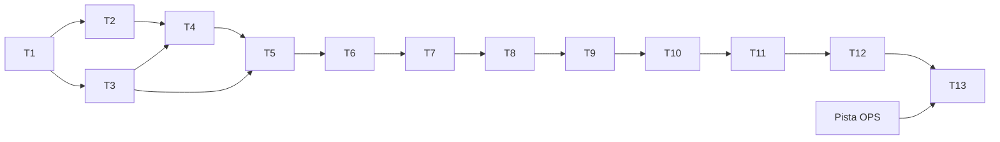

# GA · PRE-SAP — ROADMAP MAESTRO DE REMEDIACIÓN (TRANCHE 0 · §39-§51)

Determinista: cada tranche arranca solo cuando la anterior cumple su **criterio de salida**. Todas las tranches parten del baseline congelado (`f270d0b` + commits de governance) y dejan **producto desplegable**. Fase actual: remediación pre-SAP → después: certificación → después: SAP (no iniciado).

> **Addendum de gobernanza (2026-09-14 · `AOD-29`)**: GitHub Actions deja de ser gate obligatorio de las nuevas tranches PRE-SAP (decisión del propietario por costo de minutos). La certificación técnica pasa a **gates locales reproducibles** (RED→GREEN→regresión→sensibilidad con restauración por SHA explícito→suites completas→`tsc`→`build`→E2E local); `PUSH = NO` mientras dispare Actions; evidencia dependiente de CI externo ⇒ `NOT_APPLICABLE_BY_OWNER_DECISION`. Los requisitos históricos de CI (T1/AC-06, T2) permanecen como evidencia histórica **sin reescritura**. Registro: `GA_OWNER_DECISION_AOD29_GITHUB_ACTIONS_RETIRED.md`.

## 1 · Vista general

| # | Tranche | Specs/findings | Procesos | Por qué ahora (§39) | Depende de | Bloquea a |
|---|---|---|---|---|---|---|
| T1 | Gobernanza de pruebas | GA-GOV-03 — **CERRADA (2026-09-13, `60e9d9d`)**: 38 TEST_DEFECT corregidos (37 + nº38 hallado en CI); backend 1226/0/49 y vitest 314/314 en local **y en CI**; **AC-06 = PASS** (run #10 `34764423545` verde; artefactos sha256-verificados); backlog reconciliado | Todos (gate) | Sin suite verde no hay certificación válida; coste bajo, cero producto | — | **T2-T13 DESBLOQUEADAS — T2 en arranque** |
| T2 | Fundación de seguridad | R-199 · R-200 · R-202 · R-208 · GA-REM-003 AC04 | P-13 | La seguridad primero: invalida todo lo demás si falla | T1 | T9, T12, T13 |
| T3 | Alcance de datos | R-201 · R-203 · R-204+R-216 · R-221 | P-04, P-08, P-12, P-15 | Cierra fugas de dimensión empresa/unidad antes de tocar servicios núcleo | T1 | T5, T7, T12 |
| T4 | Eventos y recepción (FE) | R-190 + R-205 | P-01, P-03 | Primer eslabón visible roto de la cadena: sin ubicación/recepción no hay ciclo | T2, T3 | T5, T6, T12 |
| T5 | Contrato de captura | R-191 · R-206 · R-209 · R-210 (+R-146 si AOD-16) | P-02, P-09, P-11 | Payload y unidades correctos alimentan todos los registros posteriores | T4 | T6, T12 |
| T6 | Cadena de incubadora | R-194 | P-04, P-05 | 5 causas acopladas; tranche propia; desbloquea P-04/P-05 completos | T4, T5 | T7, T12 |
| T7 | Cierre y reversos (validadores) | R-192 · R-193 · R-211 | P-01, P-02, P-03, P-06 | Corazón de integridad: estado REVERSED, BR-18 neto, BR-17; habilita reverso UI | T3, T6 | T8, T10, T12 |
| T8 | Auditoría y evidencias | P1-12-REOPEN · R-198 · R-219 | P-02, P-09 | La trazabilidad debe ser única y fiable antes de certificar procesos | T7 | T12 (P-09) |
| T9 | Maestros y usuarios | R-215 · R-196 · R-195 (+R-122) | P-12, P-13 | Repara las superficies base de datos (maestros/usuarios) tras seguridad (T2) | T2, T8 | T12 |
| T10 | Revisión y reverso UI | R-197 · R-207 (+R-142 si AOD-17) | P-07, OD-19 | Cierra el ciclo de aprobación/reverso con UI real | T2, T7 | T12 |
| T11 | Residuales FE | R-213 · R-212 · R-218 · R-220 | Transversal, P-15 | Pulido final sin cambio de proceso; justo antes de recertificar | T9, T10 | T12 |
| T12 | Recertificación E2E | 17 procesos + decisión Wave C (AOD-10) | Todos | Recorrido integral con producto remediado y artefactos | T1-T11, Wave C decidida | T13 |
| T13 | UAT del propietario + gate final | Plan UAT (8 lotes) + Pista OPS | Todos | Validación del propietario con evidencia primaria + GO/NO-GO | T12, OPS, decisiones | GO/SAP |
| OPS | Pista de operaciones (paralela) | R-52/RES-05 · GA-REM-004 AC03/AC07 · P1-6 | Infra | Acciones fuera del código que bloquean el gate final | — (arrancable ya) | T13 |

## 2 · Ficha por tranche (estándar §39)

### T1 · Gobernanza de pruebas (`GA-GOV-03`)
- **Por qué ahora**: 37 pruebas rojas (todas TEST_DEFECT) + CI nunca ejecutado + certificaciones sin artefacto; es la precondición de validez de todo el programa.
- **Alcance**: corregir 25 tests backend (3 grupos A/B/C) y 12 Playwright (locator, fixtures BR-20/BR-21/BR-03/R-118); CI a `push` (sin bloquear `docker-push`, OD-23); plantilla de certificación con artefacto; reconciliar backlog (`R-189`, `GA-UAT-09`, `OD-21…25`); documentar contrato 403/404 (OD-16).
- **Fuera de alcance**: producto (0 líneas); R-213 (producto → T11).
- **Ficheros**: `backend/tests/**` (7), `e2e/**` (6 specs), `.github/workflows/**`, `audit/remediation/REMEDIATION_BACKLOG.md`, `specs/remediation/INDEX.md`, plantilla nueva.
- **Procesos**: gate de todos. **BU**: regresión completa. **FE/BE producto**: sin cambios. **Migraciones**: ninguna.
- **E2E**: repositorios completos verdes. **UAT**: no.
- **Criterio de salida**: backend 0 failed con artefacto; Playwright 0 failed con artefacto; CI disparado en push; backlog reconciliado; OD-16/OD-23 registradas.

### T2 · Fundación de seguridad (`R-199`, `R-200`, `R-202`, `R-208`, `GA-REM-003 AC04`)
- **Por qué ahora**: R-199 (P1) permite fabricar autoridad global; sin logout/denylist el refresh robado vive 7 días; los permisos batch contradicen a los unitarios.
- **Alcance**: validación de forma de permisos (sin `("*", all)` salvo definición del propietario `OD-13.c`); chequeo de `type` en access; `POST /logout` con denylist `jti` + auditoría `LOGOUT`; reset de contraseña con contexto; dependencias de permiso batch alineadas.
- **Ficheros**: `auth/service.py`, `auth/security.py`, `auth/router.py`, `review/router.py` (solo permisos), tests nuevos.
- **Procesos**: P-13. **BU**: aislamiento (tests OD-14/OD-16 verdes). **Migraciones**: ninguna (denylist en memoria/BD según diseño de spec).
- **E2E**: flujo login→logout→reuso de token (nuevo). **UAT**: lote U1 (T13).
- **Criterio de salida**: los 4 ataques bloqueados con test verde; suites verdes; artefacto.

### T3 · Alcance de datos (`R-201`, `R-203`, `R-204+R-216`, `R-221`)
- **Por qué ahora**: fail-open SAP, tenencia de referencias de lote, KPIs/alertas sin predicado — fugas de dimensión en el corazón multicompañía.
- **Ficheros**: `integrations/sap/service.py`, `lots/service.py` + `masters`, `reports/service.py`, `dashboard/service.py`, `operations/service.py` (unidad), tests.
- **Procesos**: P-08 (interno), P-12, P-04, P-15. **Migraciones**: ninguna.
- **E2E**: aislamiento por empresa/unidad en cada superficie corregida. **UAT**: U4/U7 (T13).
- **Criterio de salida**: sin filas cross-company en escenarios de ataque; tarjetas dashboard con claves canónicas; suites verdes.

### T4 · Eventos y recepción FE (`R-190` + `R-205`)
- **Por qué ahora**: es el primer eslabón roto de la cadena de negocio por UI (progenitoras/reproductoras): ubicación BR-08 y cuadre BR-20.
- **Ficheros**: `OperationFormPage.tsx` (helper ubicación + stage inicial), `LotDetailPage.tsx`/`lots.service.ts` (entrada), tests FE + E2E P-01/P-03.
- **Procesos**: P-01, P-03. **E2E**: cadena de recepción completa por navegación natural. **UAT**: U2/U3 (T13).
- **Criterio de salida**: lote sin galpón opera los 10 tipos; recepción BR-20 alcanzable desde el hub; E2E verdes.

### T5 · Contrato de captura (`R-191`, `R-206`, `R-209`, `R-210`, +`R-146`)
- **Por qué ahora**: payload (vacíos, números), unidad g/kg, códigos SAP y fases: los cinco defectos comparten serializador/validador y contaminan todos los registros.
- **Ficheros**: `operationPayload.ts`, `OperationFormPage.tsx` (peso), `lots.service.ts`/`LotDetailPage.tsx` (fase), `operations/service.py` (snapshot), `operations/schemas.py`; tests.
- **Procesos**: P-02, P-09, P-11. **E2E**: alta de evento con opcionales vacíos, peso en gramos, snapshot con código, transición de fase.
- **Criterio de salida**: 422 corregidos con datos reales; fase transiciona; snapshot guarda código; suites verdes.

### T6 · Cadena de incubadora (`R-194`)
- **Por qué ahora**: incubadora es proceso completo inalcanzable por UI (5 causas acopladas); depende de T4/T5 para no re-tocar el asistente.
- **Ficheros**: `OperationFormPage.tsx` (farm_id etapa incubadora, arrival_date, dosage valueAsNumber), `operations/service.py` (egg_movements fértiles, hatchery_id), schemas; tests + E2E P-04/P-05.
- **Procesos**: P-04, P-05. **E2E**: recepción de huevos → carga → nacimiento → despacho. **UAT**: U4 (T13).
- **Criterio de salida**: cadena completa verde con artefacto; KPIs incubadora (T3) consistentes.

### T7 · Cierre y reversos (`R-192`, `R-193`, `R-211`)
- **Por qué ahora**: integridad transaccional del cierre (REVERSED), BR-18 neto y BR-17 por galpón — tres caras del mismo validador.
- **Ficheros**: `operations/validators.py`, `lots/service.py`; tests (incluidos los de T1 ya verdes, ahora con casos nuevos de reverso).
- **Procesos**: P-01, P-02, P-03, P-06. **E2E**: cierre tras reverso efectivo; saldos netos; distribución multi-galpón.
- **Criterio de salida**: cierre posible tras reverso; BR-18 descuenta contrapartidas; BR-17 valida contra Σ distribuida.

### T8 · Auditoría y evidencias (`P1-12-REOPEN`, `R-198`, `R-219`)
- **Por qué ahora**: la trazabilidad es requisito de certificación (P-09) y base de la evidencia de todo lo anterior.
- **Ficheros**: `audit/*` (dedup listener/helpers, productores faltantes), `operations` (evidencias: pop eliminado, gate de estado, auditoría, persistencia), `AuditPage.tsx`; tests.
- **Procesos**: P-02, P-09. **E2E**: una acción → una fila de auditoría; evidencias sobreviven a recarga y commit; AuditPage muestra datos reales.
- **Criterio de salida**: 0 duplicados en escenarios E2E; productores definidos y probados; suite verde.

### T9 · Maestros y usuarios (`R-215`, `R-196`, `R-195`, +`R-122`)
- **Por qué ahora**: las superficies base (maestros, usuarios) se reparan una vez fijada la seguridad (T2) y el contrato de datos (T8).
- **Ficheros**: `MasterListPage.tsx` (+ErrorBoundary global), `UsersPage.tsx` (+columna Empresa), tests + E2E P-12/P-13.
- **Procesos**: P-12, P-13. **E2E**: alta completa de maestro desde UI; edición de usuario sin 422; sin React #31.
- **Criterio de salida**: 21/21 maestros operables; edición de usuario verde; boundary activo.

### T10 · Revisión y reverso UI (`R-197`, `R-207`, +`R-142` si `AOD-17`)
- **Por qué ahora**: cierra el ciclo de aprobación y la capacidad de reverso interno (backend ya existente) tras estabilizar estados (T7).
- **Ficheros**: `review/service.py` + FE de bandejas; FE nueva de reverso (`reversals`); tests + E2E P-07/OD-19.
- **Procesos**: P-07, OD-19. **Decisiones**: OD-19 §18 (UI), AOD-17 (CORRECTED). **UAT**: U6.
- **Criterio de salida**: bandejas coherentes (in_review visible); solicitud/consulta de reverso operable; semántica CORRECTED decidida y probada.

### T11 · Residuales FE (`R-213`, `R-212`, `R-218`, `R-220`)
- **Por qué ahora**: pulido sin cambio de proceso, justo antes de la recertificación; R-213 robustece `/me` (raíz del grupo B de tests).
- **Ficheros**: `auth/schemas.py` (lectura), guardas FE, reportes FE, residuales A-D por lotes.
- **Procesos**: transversal, P-15. **E2E**: regresión completa.
- **Criterio de salida**: `/me` tolerante; denegado≠vacío en superficies clave; residuales itemizados cerrados o aceptados.

### T12 · Recertificación E2E (17 procesos)
- **Por qué ahora**: solo con T1-T11 cerradas la certificación representa el producto actual.
- **Alcance**: recorrido E2E de los 17 procesos (orden del grafo de procesos) con artefacto + paridad runtime + decisión Wave C (`AOD-10`: corregir o aceptar documentado; si corregir → specs GA-REM-022 y micro-tranche previa).
- **Criterio de salida**: matriz de procesos 17/17 en estado certificable; suites 0 failed; runtime validado.

### T13 · UAT del propietario + gate final
- **Por qué ahora**: cierre con evidencia primaria; incluye GA-UAT-09 (ya pendiente) y los 8 lotes U1-U8.
- **Alcance**: lotes U1-U8 (§ plan UAT), decisiones pendientes (§25), Pista OPS cerrada, limpiezas post-decisión.
- **Criterio de salida**: GO/NO-GO final: `PRE_SAP_FUNCTIONAL_CERTIFICATION` PASS exige 17/17 + suites verdes + UAT primaria + OPS + decisiones.

### Pista OPS (paralela, no código)
- **Ítems**: montar volumen `avicola-media` (R-52/RES-05); verificar rate limit 6→429 (AC03); BD con rol mínimo + SSL (AC07); respaldo comprobado + política de migraciones (P1-6).
- **Criterio de salida**: evidencia operativa por ítem (sin ella, T13 no cierra).

## 3 · Decisiones del propietario que el roadmap requiere (§25)

| Ref | Pregunta | Bloquea | Cuándo se necesita |
|---|---|---|---|
| OD-13.c | ¿La autoridad global `("*", all)` puede existir en roles de inquilino? (propuesta del programa: NO; solo super admin) | T2 | Antes de T2 |
| OD-23 | ¿CI de tests en push a main sin bloquear docker-push? (propuesta: sí, job separado) | T1 | **Aplicada en T1** (workflow `Quality Suite (push)` independiente; EX-01 intacto) |
| OD-16 | Contrato 403/404 fail-closed como canónico (propuesta: sí) | T1 | **Aplicada en T1** (17 casos actualizados a 404/no-visibilidad) |
| AOD-16 | ¿La captura móvil genera `idempotency_key`? | Rider T5 | Antes de T5 |
| AOD-13 | ¿Módulos activables por empresa (incubadora)? | T3 (R-221) | Antes de T3 |
| AOD-14 | ¿Evidencia obligatoria en captura? | T8 (R-198) | Antes de T8 |
| OD-19 §18 | ¿UI de reverso interno? | T10 (R-207) | Antes de T10 |
| AOD-17 | Semántica de `CORRECTED` multinivel | T10 (R-142) | Antes de T10 |
| AOD-18 | Cancelación: motivo obligatorio + solo admin | T10 (R-140 rider) | Antes de T10 |
| OD-10.c | ¿UI de activación manual / clasificación pendiente? | T11 (P1-15/RES-02) | Antes de T11 |
| AOD-08 / AOD-10 | FCR/cierre y fórmulas KPI (Wave C) | T12 (P-06/P-15) | Antes de T12 |
| AOD-20/AOD-22/AOD-24/AOD-15/OD-24/AOD-19/R-156/R-177/R-125/R-127.b/R-155 | Requisitos del cliente y fase SAP | Fase SAP | Antes de fase SAP |
| GA-UAT-09 | Decisión del propietario sobre el retry R-153/R-189 | T13 | Antes de T13 |

## 4 · Grafo de ejecución

## 5 · Definición de cierre del programa

`PRE_SAP_REMEDIATION_PROGRAM` cierra cuando: 17/17 procesos certificables E2E con artefacto · suites 0 failed · UAT del propietario con evidencia primaria en los 8 lotes · Pista OPS cerrada · decisiones §25 registradas · veredicto final emitido. **SAP comienza después, si el veredicto es GO.**
