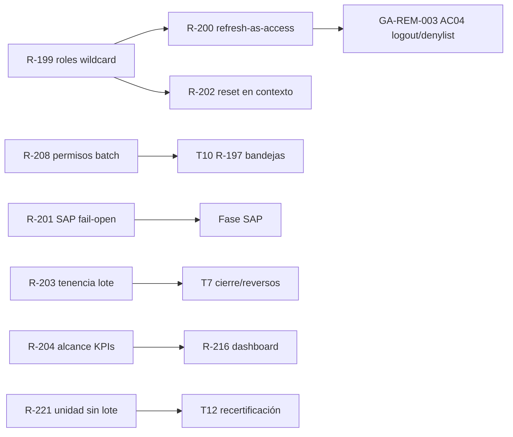

# GA · PRE-SAP — MATRIZ DE DEPENDENCIAS DE SEGURIDAD (TRANCHE 0 · §20)

Regla: la **fundación de seguridad se ejecuta primero** (T2/T3) porque condiciona la validez de todo lo que se certifique después (procesos, UAT, SAP). Ninguna spec de seguridad puede quedar «para después» de una recertificación.

## 1 · Matriz

| ID | Familia (GAP) | Ataque / precondición | Roles afectados | Rutas/superficie | Procesos | Impacto FE/BE | Dependencia | Prioridad | Debe ejecutarse antes de | Tranche |
|---|---|---|---|---|---|---|---|---|---|---|
| **R-199** | GAP-01 · fabricación de autoridad global | Rol de inquilino con `role:create|update` define `permissions = [["*","all"]]` → `is_super_admin` sintético → `switch-company` y acceso total | Tenant admin / cualquier rol con gestión de roles | `POST/PUT /roles` (`auth/service.py:598-606,642-648`) | P-13 | BE: validar forma de permisos; FE: formulario de roles (T9-adyacente) | Ninguna (raíz) | **P1** | T9 (UI usuarios/roles), T12 (recertificación), T13 (UAT) | **T2** |
| **R-200** | GAP-03 · refresh como access | Robo de refresh token (`/auth/refresh`) → suplantación durante 7 días sin rotación efectiva de tipo | Cualquiera con refresh robado | `decode_token` (`security.py:59-65,87-93` vs `auth/service.py:243`) | P-13 | BE: chequear `type` en decode de access | Mismo fichero que R-199 (orden interno) | **P2** | T12, T13 | **T2** |
| **GA-REM-003 AC04** (rider heredado) | GAP-03 amplificado · sin logout servidor | No existe `POST /logout`; un refresh robado sobrevive 7 días; `LOGOUT` no auditable | Todos | `auth/router.py` (ausente) | P-13 | BE: endpoint + denylist `jti`; FE: acción de logout (ya existe logout local) | Se implementa **con** R-200 (mismo ciclo de vida de token) | **P1** | T12, T13, GA-UAT-09 (sesión del propietario) | **T2** |
| **R-202** | GAP-04 · reset de contraseña fuera de contexto | Reset sólo para `is_super_admin` sin contexto de empresa → operación imposible para admin de empresa u operación cruzada mal definida | Super admin / admin de empresa | `auth/service.py:434-455` | P-13 | BE+FE (formulario admin) | Mismo módulo `auth` | **P2** no bloqueante | T11/T12 | **T2** (rider) |
| **R-208** | permisos de lote desalineados | `batch-approve/reject` exigen `review:review` mientras las unitarias exigen `approvals:approve/reject` → **el revisor puede aprobar en lote lo que no puede aprobar de una en una** (o al revés según rol) | Revisor / aprobador | `review/router.py:137,143-153` | P-07 | BE: alinear dependencias de permiso | Comparte fichero con R-197 (T10) — ejecutar la parte permisos en T2 sin tocar el servicio | **P2 bloqueante** | T10, T12 | **T2** |
| **R-201** | GAP-02 · SAP fail-open | `_company_filter` sin contexto de petición → `true()`; `retry_failed` procesa todas las empresas | Sistema / operador SAP | `integrations/sap/service.py:76-81` | P-08 | BE: fail-closed + contexto obligatorio | Patrón de alcance análogo a R-204 | **P2 bloqueante** | Fase SAP, T12 (P-08) | **T3** |
| **R-203** | GAP-05 · tenencia de referencias del lote | `house_id`/`genetic_line_id`/`weight_curve_id` aceptados sin verificar empresa | Cualquier rol con alta de lote | `masters/models.py` + `lots` service | P-12 | BE: validación de tenencia | Ninguna | **P2 bloqueante** | T7 (toca `lots/service.py`) | **T3** (antes de T7) |
| **R-204** | GAP-06/07 · agregados sin predicado de unidad | KPIs de incubadora sin `lot_id` agregan toda la empresa; `active_alerts` calcula ámbito BU y no lo aplica | Roles con `reports:read`/dashboard | `reports/service.py`, `dashboard/service.py` | P-04/P-15 | BE: predicados de alcance; FE: tarjetas correctas (R-216) | Fusionar con R-216 | **P2 bloqueante** | T12 (P-04/P-15), T13 | **T3** |
| **R-221** | eventos sin lote / módulo deshabilitado | Eventos `LOT_OPTIONAL_EVENTS` no derivan unidad → fuga de dimensión; `hatchery_inspection` registrable con incubadora deshabilitada | Operativo | `operations/service.py` | P-12 | BE: derivación de unidad + gate de módulo | Decisión AOD-13 | **P2 bloqueante** | T12 | **T3** (rider) |
| R-123 (contexto) | `scope_type` inerte | Alcances `all/company/farm` almacenados y no evaluados | Todos | `security.py:209` | P-13 | BE: evaluación de alcance (requiere OD-13) | OD-13 pendiente | P2 no bloqueante | No ejecutar sin decisión | Nota T2 (no cambiar) |
| R-83 (contexto) | auditoría sin empresa | Acciones globales no atribuibles no auditables (`company_id` NOT NULL) | Sistema | `audit/models.py:78` | P-09 | BE: nullabilidad + política | Familia P1-12 (T8) | P2 | T8 | Nota T8 |
| P1-6 / GA-REM-004 AC07 / RES-05 (contexto ops) | infraestructura | BD pública con superusuario; respaldo no comprobado; volumen `avicola-media` sin montar (evidencias efímeras) | Ops | Infra fuera del repo | Todos | Pista OPS | — | **P1** | T13 (gate final) | **Pista OPS** |

## 2 · Orden interno de la fundación

- **T2 (fundación de sesión/roles)**: R-199 → R-200 → AC04 (logout) → R-202; y R-208 (parte permisos) sin tocar la lógica de R-197.
- **T3 (alcance de datos)**: R-201, R-203, R-204+R-216, R-221.
- Nada de T4-T11 toca `auth/service.py` ni `security.py` — evita colisiones (ver matriz de touchpoints).
- La Pista OPS corre en paralelo documental (no toca código) y cierra antes del gate T13.

## 3 · Criterio de salida de T2/T3

- Tests de seguridad nuevos por spec (RED→GREEN) + suites existentes verdes (tras T1).
- Evidencia: corridas con artefacto, y verificación de que el «ataque» descrito en cada fila queda bloqueado (p.ej. intento de `("*", all)` → 422/403; refresh en `Authorization` → 401; `retry_failed` sin contexto → 0 filas).
