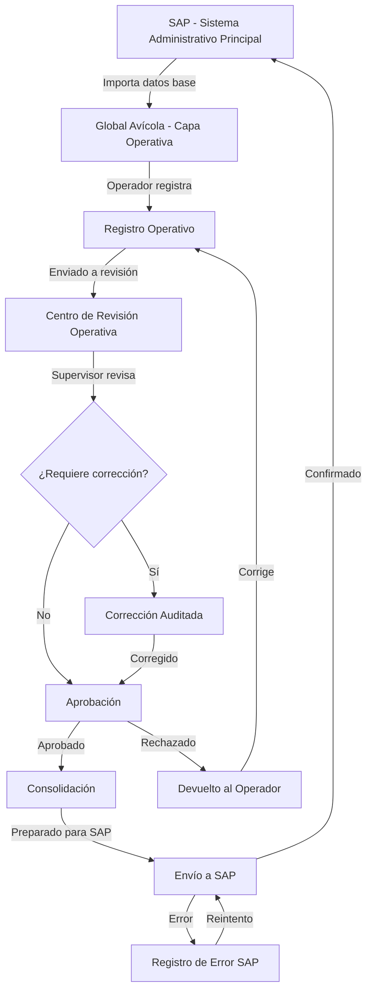

# Especificación Funcional — Global Avícola

> **Documento:** 02-functional-spec.md
> **Versión:** 1.0.0
> **Fecha:** 2026-06-22
> **Estado:** Borrador para revisión

---

## 1. INTRODUCCIÓN

Este documento describe la especificación funcional completa del sistema Global Avícola. Define todos los módulos, funcionalidades, flujos de usuario, reglas de negocio y criterios de aceptación.

---

## 2. FLUJO CENTRAL DEL SISTEMA



### Principio Fundamental

> **SAP → Datos base importados → Global Avícola Operativo → Bandeja de revisión → Corrección/validación → Aprobación → Consolidación → Envío a SAP**

---

## 3. MÓDULOS FUNCIONALES

### 3.1 MÓDULO 1: Autenticación y Gestión de Usuarios

#### 3.1.1 Login
- **Prioridad:** Crítica (MVP)
- **Descripción:** Autenticación de usuarios con JWT
- **Campos:** Usuario, Contraseña
- **Validaciones:** Credenciales válidas, cuenta activa, sesión no expirada
- **Idioma:** Selector de idioma visible en pantalla de login
- **Seguridad:** Rate limiting, bloqueo temporal tras N intentos fallidos

#### 3.1.2 Gestión de Usuarios
- **Prioridad:** Alta
- **Descripción:** CRUD de usuarios del sistema
- **Campos:** Nombre, Apellido, Email, Username, Teléfono, Rol, Empresa, Estado (Activo/Inactivo)
- **Permisos:** Solo administradores

#### 3.1.3 Gestión de Roles
- **Prioridad:** Alta
- **Descripción:** CRUD de roles con permisos granulares
- **Permisos por rol:**
  - Módulos accesibles (granjas, incubadora, engorde, reportes, etc.)
  - Acciones por módulo (leer, crear, editar, eliminar)
  - Acciones especiales (corregir, aprobar, rechazar, enviar a SAP)
  - Alcance por granja/empresa (multi-empresa)

#### 3.1.4 Aislamiento Multi-Compañía (CRÍTICO)
- **Prioridad:** Crítica
- **Descripción:** El sistema soporta múltiples razones sociales (compañías) con aislamiento total de datos.
- **Reglas:**
  - Cada usuario pertenece a una compañía (`company_id` requerido, excepto Super Admin).
  - Super Admin (rol con `module="*", scope_type="all"`) ve TODAS las compañías.
  - Usuarios regulares SOLO ven datos de su compañía (`WHERE company_id = ?` en todas las queries).
  - El JWT incluye `company_id` y `role_id` para no consultar BD en cada request.
  - Toda entidad creada hereda automáticamente el `company_id` del usuario.
  - Permisos con alcance: `all` (todas las empresas), `company` (una empresa específica), `farm` (una granja específica).
  - Configuración SAP por compañía (cada empresa puede tener su propio entorno S/4HANA).
  - Niveles de aprobación configurables por compañía (`Company.approval_levels`).
  - Selector de compañía en frontend para usuarios multi-empresa (futuro).
  - Auditoría registra `company_id` en cada acción.
- **Implementado en:** `security.py` (`get_current_user`, `get_company_filter`, `require_company`, `is_super_admin`), `MasterService._apply_company_filter()`.

#### 3.1.4 Perfil de Usuario
- **Prioridad:** Media
- **Descripción:** Cambio de contraseña, preferencias de idioma, datos personales

---

### 3.2 MÓDULO 2: Maestros

#### 3.2.1 Catálogos Base
| Maestro | Campos clave | Prioridad |
|---|---|---|
| **Empresas** | Nombre, RUC/RUT, dirección, país, moneda, configuración SAP | Alta |
| **Granjas** | Nombre, empresa, ubicación, tipo, estado | Crítica |
| **Galpones** | Nombre, granja, capacidad, tipo, estado | Crítica |
| **Incubadoras** | Nombre, empresa, ubicación, capacidad, estado | Crítica |
| **Nacedoras** | Nombre, incubadora, capacidad, estado | Alta |
| **Líneas Genéticas** | Nombre, código, proveedor, características | Alta |
| **Razas** | Nombre, línea genética, tipo (pesada/liviana) | Alta |
| **Tipos de Ave** | Nombre, descripción, fase productiva | Alta |
| **Fases Productivas** | Nombre, orden, duración estimada | Alta |
| **Proveedores** | Nombre, código SAP, país, tipo | Alta |
| **Tipos de Alimento** | Nombre, código, presentación | Alta |
| **Vacunas** | Nombre, laboratorio, tipo, dosis estándar | Alta |
| **Medicamentos** | Nombre, laboratorio, presentación | Media |
| **Causas de Mortalidad** | Nombre, categoría, requiere atención | Alta |
| **Causas de Descarte** | Nombre, categoría | Alta |
| **Transportes** | Nombre, placa, tipo, capacidad | Media |
| **Plantas de Beneficio** | Nombre, ubicación, empresa | Media |

#### 3.2.2 Maestros de Flujo
| Maestro | Descripción | Prioridad |
|---|---|---|
| **Estados de Registro** | Borrador, Registrado, En Revisión, Devuelto, Corregido, Rechazado, Aprobado, Consolidado, Enviado SAP, Confirmado SAP, Error SAP, Anulado | Crítica |
| **Motivos de Rechazo** | Catálogo configurable de motivos | Alta |
| **Tipos de Corrección** | Error de digitación, Error de medición, Dato faltante, Ajuste autorizado | Alta |

---

### 3.3 MÓDULO 3: Referencia e Integración SAP

#### 3.3.1 Datos de Referencia SAP
- **Prioridad:** Crítica
- **Descripción:** Importación y visualización de datos maestros y documentos desde SAP
- **Entidades SAP referenciadas:**
  - Órdenes de Compra (Purchase Orders)
  - Órdenes de Transferencia (Transfer Orders)
  - Centros (Plants/Centers)
  - Almacenes (Storage Locations)
  - Materiales (Materials)
  - Proveedores (Vendors)
  - Lotes SAP (Batches)

#### 3.3.2 Abstracción de Integración SAP
- **Prioridad:** Crítica
- **Descripción:** Capa desacoplada para integración con SAP
- **Mecanismos soportados (diseño):** API REST, Archivos planos, Middleware, OData, BAPI, RFC
- **Modo inicial:** Manual (carga/descarga de archivos o entrada manual de referencias)
- **Principio:** Cambiar el mecanismo no debe afectar el dominio principal

#### 3.3.3 Sincronización SAP
- **Prioridad:** Alta
- **Descripción:** Sincronización controlada de datos entre SAP y Global Avícola
- **Dirección SAP → GA:** Maestros, documentos, órdenes
- **Dirección GA → SAP:** Movimientos consolidados y aprobados
- **Idempotencia:** Garantizada por referencia externa + hash de payload
- **Bitácora:** Registro de cada sincronización con payload, respuesta y estado

---

### 3.4 MÓDULO 4: Proceso de Abuelas e Importación

#### 3.4.1 Plan de Importación
- **Prioridad:** Alta
- **Descripción:** Registro completo del proceso de importación de abuelas
- **Campos:**
  - Orden de compra SAP
  - Proveedor internacional
  - País de origen
  - Línea genética
  - Tipo de ave
  - Sexo (cantidad machos/hembras)
  - Cantidad comprada
  - Cantidad embarcada
  - Cantidad recibida
  - Mortalidad en traslado
  - Documentos sanitarios (adjuntos)
  - Permisos de importación (adjuntos)
  - Documentos aduanales (adjuntos)
  - Certificados de vacunación (adjuntos)
  - Certificados de origen (adjuntos)
  - Fecha de salida (origen)
  - Fecha de llegada (destino)
  - Transporte
  - Condición de recepción
  - Cuarentena (días, fecha fin)
  - Inspección sanitaria inicial

#### 3.4.2 Creación de Lote de Abuelas
- **Prioridad:** Alta
- **Descripción:** Al completar la importación, se crea automáticamente el lote de abuelas
- **Vinculación:** Lote → Granja → Galpón → Trazabilidad hacia generaciones posteriores

---

### 3.5 MÓDULO 5: Reproductoras — Fase Cría

#### 3.5.1 Registro de Lote de Cría
- **Prioridad:** Crítica
- **Descripción:** Creación y configuración de lote en fase de cría
- **Campos:** Lote, Granja, Galpón(es), Orden de compra/transferencia SAP, Proveedor, Raza/Línea genética, Fecha de inicio

#### 3.5.2 Recepción y Distribución de Aves
- **Prioridad:** Crítica
- **Descripción:** Registro de recepción de aves en granja
- **Campos:** Lote, Fecha despacho, Fecha recepción, Cantidad hembras, Cantidad machos, Peso promedio proveedor, Peso promedio granja, Distribución por galpón

#### 3.5.3 Registro de Alimento
- **Prioridad:** Crítica
- **Descripción:** Registro diario/semanal de consumo de alimento
- **Campos:** Lote, Granja, Galpón, Fecha, Tipo de alimento, Cantidad (kg), Orden de alimento SAP (si aplica)

#### 3.5.4 Registro de Pesaje
- **Prioridad:** Crítica
- **Descripción:** Registro semanal de pesaje de aves
- **Campos:** Lote, Granja, Galpón, Fecha, Semana, Peso promedio, Cantidad aves pesadas, Sexo (macho/hembra/mixto)

#### 3.5.5 Registro de Mortalidad
- **Prioridad:** Crítica
- **Descripción:** Registro diario de mortalidad
- **Campos:** Lote, Granja, Galpón, Fecha, Cantidad machos, Cantidad hembras, Causa, Observaciones
- **Validación crítica:** No puede exceder el saldo disponible de aves

#### 3.5.6 Registro de Vacunación
- **Prioridad:** Alta
- **Descripción:** Registro de vacunas aplicadas
- **Campos:** Lote, Granja, Galpón, Fecha, Vacuna, Dosis, Vía de aplicación, Lote de vacuna

#### 3.5.7 Registro de Medicamentos
- **Prioridad:** Media
- **Descripción:** Registro de medicamentos aplicados
- **Campos:** Lote, Granja, Galpón, Fecha, Medicamento, Dosis, Vía, Duración, Motivo

#### 3.5.8 Inspección de Granja
- **Prioridad:** Alta
- **Descripción:** Registro periódico de condiciones de granja
- **Campos:** Lote, Granja, Galpón, Fecha, Condición de cama, Equipos (checklist), Temperatura, Humedad, Observaciones

#### 3.5.9 Salida de Aves (Transición a Producción)
- **Prioridad:** Crítica
- **Descripción:** Registro de salida/transferencia de aves a fase de producción
- **Campos:** Lote origen, Granja origen, Galpón, Granja/Planta destino, Transporte, Fecha envío, Cantidad, Peso promedio salida

#### 3.5.10 Alertas de Cría
- **Prioridad:** Alta
- **Descripción:** Alertas automáticas por desviaciones
- **Disparadores:** Peso fuera de estándar, Mortalidad > umbral, Consumo anormal, Vacuna vencida

---

### 3.6 MÓDULO 6: Reproductoras — Fase Producción

#### 3.6.1 Transición desde Cría
- **Prioridad:** Crítica
- **Descripción:** Cierre de fase cría y apertura de fase producción
- **Incluye:** Población inicial, relación macho/hembra, saldos iniciales

#### 3.6.2 Registro de Postura / Recolección de Huevos
- **Prioridad:** Crítica
- **Descripción:** Registro diario de producción de huevos
- **Campos:** Lote, Granja, Galpón, Fecha, Cantidad total, Huevos fértiles, Huevos no aptos, Huevos rotos, Huevos sucios, Huevos comerciales, Peso promedio

#### 3.6.3 Clasificación de Huevos
- **Prioridad:** Alta
- **Descripción:** Clasificación detallada de huevos para incubación
- **Campos:** Fecha, Cantidad fértiles, Cantidad sucios, Cantidad infértiles, Cantidad descartados, Peso promedio

#### 3.6.4 Despacho de Huevos a Incubadora
- **Prioridad:** Crítica
- **Descripción:** Registro de envío de huevos a incubadora
- **Campos:** Lote origen, Granja origen, Galpón, Fecha postura, Fecha despacho, Cantidad enviada, Clasificación, Condición, Tiempo y Temp. almacenamiento, Transporte, Guía

#### 3.6.5 KPIs de Producción
- **Porcentaje de postura** (huevos/ave/día)
- **Huevos por ave alojada**
- **Fertilidad**
- **Mortalidad acumulada**
- **Consumo de alimento por ave**

---

### 3.7 MÓDULO 7: Incubación

#### 3.7.1 Recepción de Huevos en Incubadora
- **Prioridad:** Crítica
- **Descripción:** Registro de recepción de huevos fértiles
- **Campos:** Lote origen, Granja origen, Fecha postura, Fecha recepción, Cantidad recibida, Diferencias vs enviado, Condición de recepción

#### 3.7.2 Carga de Incubación
- **Prioridad:** Crítica
- **Descripción:** Registro de carga en incubadora
- **Campos:** Recepción, Incubadora asignada, Fecha de carga, Cantidad cargada, Parámetros (temperatura, humedad, CO2, volteo)

#### 3.7.3 Ovoscopia
- **Prioridad:** Alta
- **Descripción:** Registro de resultados de ovoscopia
- **Campos:** Fecha, Huevos infértiles, Embriones muertos tempranos, Embriones muertos tardíos, Huevos contaminados

#### 3.7.4 Transferencia a Nacedora
- **Prioridad:** Alta
- **Descripción:** Registro de transferencia de incubadora a nacedora
- **Campos:** Incubación origen, Nacedora, Fecha, Cantidad transferida

#### 3.7.5 Nacimiento
- **Prioridad:** Crítica
- **Descripción:** Registro de nacimiento de pollitos
- **Campos:** Incubación, Nacedora, Fecha, Pollitos nacidos, Pollitos viables, Pollitos descartados, Vacunación en planta, % eclosión, % nacimiento

#### 3.7.6 Despacho de Pollitos a Engorde
- **Prioridad:** Crítica
- **Descripción:** Registro de salida de pollitos a granjas de engorde
- **Campos:** Lote nacimiento, Granja destino, Transporte, Fecha, Cantidad enviada, Tipo (macho/hembra/mixto)

---

### 3.8 MÓDULO 8: Pollo de Engorde

#### 3.8.1 Recepción de Pollitos
- **Prioridad:** Crítica
- **Descripción:** Registro de recepción en granja de engorde
- **Campos:** Lote origen (incubadora), Granja destino, Galpón, Fecha, Cantidad recibida, Mortalidad inicial

#### 3.8.2 Registros Operativos (similares a Cría)
- Alimento (diario)
- Pesaje (semanal)
- Mortalidad (diaria)
- Vacunación
- Medicamentos
- Inspección de granja

#### 3.8.3 KPIs de Engorde
- **Ganancia diaria de peso**
- **Conversión alimenticia** (kg alimento / kg peso ganado)
- **Viabilidad** (% supervivencia)
- **Peso promedio vs estándar**
- **Uniformidad**
- **Edad al sacrificio**

#### 3.8.4 Cierre y Despacho a Planta de Beneficio
- **Prioridad:** Crítica
- **Descripción:** Cierre operativo del lote y envío a planta
- **Campos:** Lote, Planta destino, Fecha, Cantidad enviada, Peso promedio final, Indicadores finales

---

### 3.9 MÓDULO 9: Activación Manual de Lotes Existentes

#### 3.9.1 Funcionalidad
- **Prioridad:** Crítica (para implantación)
- **Descripción:** Permite activar lotes que ya están en proceso antes de la implantación del sistema
- **Campos requeridos:**
  - Lote ID
  - Fase actual (Cría/Producción/Engorde/Incubación)
  - Fecha real de inicio
  - Edad actual (días/semanas)
  - Granja
  - Galpón(es)
  - Línea genética
  - Referencia SAP (si existe)
  - Saldos iniciales de aves (machos/hembras)
  - Mortalidad acumulada previa
  - Descartes acumulados
  - Alimento acumulado
  - Peso promedio actual
  - Producción acumulada de huevos (si aplica)
  - Huevos enviados a incubadora (si aplica)
  - Pollitos nacidos/transferidos (si aplica)

#### 3.9.2 Reglas
- Se marca el lote como "activado manualmente"
- Se audita: usuario, fecha, motivo, datos cargados
- Se adjunta soporte documental
- Se evita doble conteo
- Se permite continuar operación desde el saldo inicial
- Se genera reporte de apertura (opening balance)

---

### 3.10 MÓDULO 10: Centro de Revisión Operativa / Bandeja de Aprobación

> **Este es el módulo central diferenciador del sistema.**

#### 3.10.1 Bandeja de Revisión
- **Prioridad:** Crítica (MVP)
- **Descripción:** Panel central donde los supervisores revisan registros operativos pendientes
- **Filtros:** Granja, Lote, Galpón, Fecha (rango), Operador, Etapa (cría/producción/engorde/incubadora), Tipo de registro (alimento/pesaje/mortalidad/etc.), Estado
- **Vistas:**
  - Lista de registros pendientes
  - Detalle de registro con datos originales
  - Comparación side-by-side: datos SAP vs datos operativos

#### 3.10.2 Corrección de Registros
- **Prioridad:** Crítica
- **Descripción:** Un usuario autorizado puede corregir un registro antes de aprobar
- **Reglas:**
  - El valor original se conserva
  - El valor corregido se registra
  - Se registra: usuario corrector, fecha, hora, motivo, observación
  - La corrección es auditable
  - Se puede devolver al operador con observaciones

#### 3.10.3 Aprobación
- **Prioridad:** Crítica
- **Flujo:**
  1. Registro en estado "En Revisión"
  2. Supervisor revisa → "Revisado"
  3. Aprobador aprueba → "Aprobado" O rechaza → "Rechazado" (con motivo obligatorio)
- **Aprobación por niveles (configurable):**
  - Nivel 1: Operador registra
  - Nivel 2: Supervisor revisa
  - Nivel 3: Coordinador aprueba
  - Nivel 4: SAP (consolidación automática)
- **Modos de aprobación:** Individual, Por lote, Por período

#### 3.10.4 Rechazo
- **Prioridad:** Crítica
- **Descripción:** Un aprobador puede rechazar un registro
- **Reglas:**
  - Motivo de rechazo obligatorio
  - Observaciones opcionales
  - El registro vuelve a estado "Devuelto"
  - El operador puede corregir y reenviar
  - El historial de rechazos queda registrado

#### 3.10.5 Consolidación
- **Prioridad:** Crítica
- **Descripción:** Los registros aprobados se consolidan para envío a SAP
- **Proceso:**
  1. Agrupar movimientos aprobados por lote/período
  2. Validar integridad (totales, referencias SAP)
  3. Generar payload para SAP
  4. Marcar como "Consolidado"

---

### 3.11 MÓDULO 11: Auditoría Interna

#### 3.11.1 Registro de Auditoría
- **Prioridad:** Crítica
- **Descripción:** Cada acción en el sistema genera un registro de auditoría inmutable
- **Datos registrados:**
  - Usuario (quién)
  - Acción (creó, editó, corrigió, revisó, aprobó, rechazó, envió a SAP)
  - Fecha y hora exacta (cuándo)
  - Módulo, Lote, Granja, Galpón (dónde)
  - Tipo de operación
  - Estado anterior → Estado nuevo
  - Valor anterior → Valor nuevo
  - Motivo del cambio
  - Observaciones
  - Documento SAP relacionado
  - IP o dispositivo
  - Payload/resumen técnico de integración (protegido)

#### 3.11.2 Vista de Auditoría
- **Prioridad:** Alta
- **Usuarios autorizados:** Administradores, Auditores internos, Supervisores autorizados, Usuarios SAP autorizados
- **Filtros:** Por usuario, lote, fecha, tipo de operación, módulo, estado, documento SAP

#### 3.11.3 Corrección Auditada
- **Conserva:** Valor original + Valor corregido + Responsable + Fecha + Hora + Motivo
- **Cada aprobación conserva:** Responsable, Fecha, Hora, Versión aprobada, Resumen de datos
- **Cada rechazo conserva:** Responsable, Fecha, Hora, Motivo (obligatorio), Observaciones
- **Cada envío SAP conserva:** Payload, Respuesta, Identificador SAP, Fecha, Hora, Estado, Usuario/Proceso

---

### 3.12 MÓDULO 12: Reportes e Indicadores

#### 3.12.1 KPIs Operativos
| Indicador | Fórmula / Descripción |
|---|---|
| Mortalidad diaria | Aves muertas hoy |
| Mortalidad acumulada | % mortalidad acumulada del lote |
| Viabilidad | % de aves vivas sobre iniciales |
| Peso promedio vs estándar | Comparación con curva estándar |
| Uniformidad | % de aves dentro de ±10% del peso promedio |
| Consumo de alimento | kg acumulados |
| Conversión alimenticia | kg alimento / kg peso ganado |
| Producción de huevos | Huevos/ave/día |
| Fertilidad | % huevos fértiles |
| Eclosión | % huevos eclosionados sobre fértiles |
| Nacimiento | % pollitos nacidos sobre huevos cargados |
| Rendimiento incubadora | Pollitos viables / huevos cargados |
| Diferencias SAP vs App | Comparación de cantidades |

#### 3.12.2 Reportes
- **Reporte de lote:** Resumen completo de un lote desde inicio hasta cierre
- **Reporte de diferencias SAP:** Registros con discrepancias vs SAP
- **Reporte de auditoría por usuario**
- **Reporte de auditoría por lote**
- **Reporte de estados:** Pendientes, aprobados, rechazados, enviados
- **Exportación:** Excel, PDF

---

### 3.13 MÓDULO 13: Dashboard

#### 3.13.1 Dashboard Móvil (Operador)
- Lotes activos asignados
- Últimos registros
- Tareas pendientes
- Alertas

#### 3.13.2 Dashboard Web (Supervisor/Administrador)
- KPIs ejecutivos por fase
- Gráficos de tendencias
- Registros pendientes de revisión
- Alertas de desviación
- Estado de integración SAP

---

### 3.14 MÓDULO 14: Notificaciones y Alertas

- **Prioridad:** Media
- **Tipos de alerta:**
  - Registro pendiente de revisión > 24h
  - Registro rechazado (notificar al operador)
  - Mortalidad > umbral configurable
  - Peso fuera de estándar
  - Error de envío SAP
  - Lote próximo a cierre

---

## 4. ESTADOS DE UN REGISTRO OPERATIVO

```
Borrador → Registrado → Enviado a Revisión → En Revisión
    → Devuelto con Observaciones → Corregido
    → Rechazado
    → Aprobado → Consolidado → Enviado a SAP
        → Confirmado por SAP
        → Error de Envío SAP
    → Anulado (con auditoría)
```

---

## 5. REGLAS DE NEGOCIO CRÍTICAS

| # | Regla | Módulo |
|---|---|---|
| R1 | No permitir mortalidad mayor al saldo disponible de aves | Mortalidad |
| R2 | No permitir despacho de huevos mayor al disponible | Producción |
| R3 | No permitir cargar incubadora con más huevos que los recibidos | Incubación |
| R4 | No permitir despachar pollitos por encima de nacidos viables | Incubación |
| R5 | No permitir cierre de lote sin resumen final | Cierre |
| R6 | No permitir fechas operativas anteriores a la activación del lote (salvo carga inicial autorizada) | Todos |
| R7 | No permitir movimientos sin lote activo | Todos |
| R8 | No permitir movimientos sin granja/galpón cuando aplique | Todos |
| R9 | Toda corrección debe auditarse (valor original + corregido) | Corrección |
| R10 | Toda eliminación debe ser lógica y conservar trazabilidad | Todos |
| R11 | Los documentos SAP no deben duplicarse | SAP |
| R12 | Los movimientos hacia SAP deben ser idempotentes | SAP |
| R13 | Ningún dato operativo debe enviarse a SAP sin aprobación | SAP |
| R14 | Ningún operador debe aprobar su propia carga (si el flujo requiere segregación) | Aprobación |
| R15 | Los registros enviados a SAP no deben editarse directamente | SAP |
| R16 | Cualquier ajuste post-SAP debe hacerse mediante reverso, corrección auditada o nuevo movimiento autorizado | SAP |

---

## 6. ROLES Y PERMISOS

### 6.1 Roles del Sistema

| Rol | Descripción | Permisos clave |
|---|---|---|
| **Super Administrador** | Control total del sistema | Todo |
| **Administrador de Empresa** | Gestión de una empresa específica | Usuarios, roles, maestros, configuración |
| **Supervisor Avícola** | Supervisión operativa | Revisar, corregir, devolver registros |
| **Aprobador** | Aprobación de registros | Aprobar, rechazar, ver auditoría |
| **Operador de Granja** | Registro operativo en campo | Crear registros, ver sus propios registros |
| **Operador de Incubadora** | Registro en incubadora | Crear registros de incubación |
| **Operador de Engorde** | Registro en engorde | Crear registros de engorde |
| **Veterinario** | Gestión sanitaria | Registrar vacunas, medicamentos, alertas |
| **Analista SAP** | Gestión de integración SAP | Sincronizar, ver errores, enviar a SAP |
| **Auditor** | Consulta de auditoría | Ver auditoría, reportes |
| **Consulta / Reportes** | Solo lectura | Ver dashboards, KPIs, reportes |

### 6.2 Permisos Especiales
- **Corregir antes de aprobar** — Solo supervisores y aprobadores
- **Aprobar** — Solo aprobadores designados
- **Enviar a SAP** — Solo analistas SAP o proceso automático
- **Ver auditoría** — Administradores, auditores, supervisores autorizados
- **Activar lotes manualmente** — Solo administradores

---

## 7. REQUISITOS DE INTERFAZ

### 7.1 Vista Móvil (Mobile-First)
- Formularios cortos, usables con una mano
- Botones grandes (> 44px touch target)
- Validación visible en tiempo real
- Confirmación antes de registrar
- Navegación inferior (Home, Registro, KPIs, Perfil)
- Modo offline-awareness (almacenamiento local si no hay conexión — futuro)

### 7.2 Vista Web Administrativa
- Dashboard ejecutivo con KPIs
- Tablas con filtros avanzados, paginación, ordenamiento
- Panel de revisión con vista de comparación
- Panel de aprobación con acciones en lote
- Panel de auditoría con filtros avanzados
- Panel de integración SAP con bitácora de envíos
- Exportación Excel/PDF

### 7.3 Diseño Visual
- **Paleta:** Blanco (#FFFFFF) base, Azules corporativos (#1E3A5F, #2563EB, #3B82F6)
- **Estados:** Verde (#16A34A) aprobado, Amarillo (#EAB308) pendiente, Rojo (#DC2626) rechazado, Azul (#2563EB) en proceso
- **Tipografía:** Inter (sans-serif), limpia y legible
- **Componentes:** Tarjetas, tablas, modales, botones, chips de estado
- **Iconografía:** Conjunto consistente de iconos para cada módulo

---

## 8. IDIOMA (i18n)

- **Idiomas:** Español (default), Inglés
- **Implementación:** react-i18next con archivos JSON de traducción
- **Selector de idioma:** Visible en header/navbar
- **Cobertura:** 100% de textos visibles (etiquetas, mensajes, validaciones, estados, reportes)
- **Entidades técnicas:** Pueden usar inglés internamente (nombres de tablas, campos, API)

---

## 9. COMPATIBILIDAD

### 9.1 Navegadores
- Chrome (últimas 2 versiones)
- Edge (últimas 2 versiones)
- Firefox (últimas 2 versiones)
- Safari (últimas 2 versiones)
- Opera (última versión)
- iOS Safari (últimas 2 versiones)
- Android Chrome (últimas 2 versiones)
- Samsung Internet (última versión)

### 9.2 Viewports
- 360×640 (móvil pequeño)
- 375×667 (iPhone SE)
- 390×844 (iPhone 14)
- 412×915 (Android estándar)
- 430×932 (iPhone 15 Pro Max)
- 768×1024 (Tablet vertical)
- 1440×900 (Desktop administrativo)

---

## 10. CRITERIOS DE ACEPTACIÓN GENERALES

El sistema será aceptable cuando:

1. ✅ El operador puede registrar datos desde móvil
2. ✅ Los registros quedan en estado "pendiente de revisión"
3. ✅ Un supervisor puede revisar los registros
4. ✅ Un usuario autorizado puede corregir (conservando original)
5. ✅ Las correcciones quedan auditadas
6. ✅ Un aprobador puede aprobar o rechazar
7. ✅ Los datos aprobados se consolidan
8. ✅ Los datos consolidados quedan listos para SAP
9. ✅ El envío a SAP queda auditado
10. ✅ Los errores SAP se registran y permiten reintento
11. ✅ No hay doble envío de movimientos (idempotencia)
12. ✅ Se puede consultar trazabilidad completa de cualquier registro
13. ✅ Se sabe quién cargó, quién corrigió, quién aprobó y qué se envió a SAP
14. ✅ La vista mobile y web tienen diseño profesional blanco/azul
15. ✅ La aplicación funciona en español e inglés
16. ✅ La aplicación funciona en los navegadores y viewports especificados
