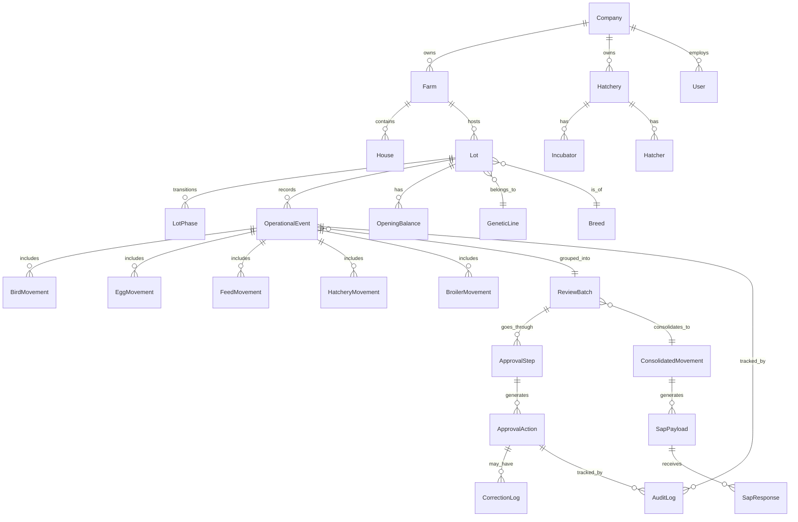
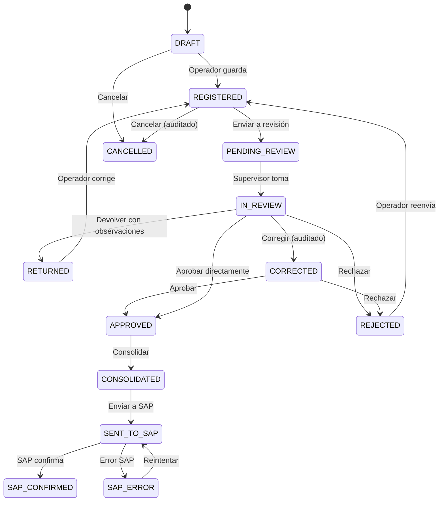

# Modelo de Dominio — Global Avícola

> **Documento:** 03-domain-model.md
> **Versión:** 1.0.0
> **Fecha:** 2026-06-22

---

## 1. INTRODUCCIÓN

Este documento define el modelo de dominio conceptual de Global Avícola. Describe las entidades principales, sus relaciones, y los agregados del dominio avícola. Este modelo es independiente de la tecnología de persistencia.

---

## 2. DIAGRAMA CONCEPTUAL PRINCIPAL



---

## 3. ENTIDADES PRINCIPALES

### 3.1 Agregado: Empresa (Company)

```
Company
├── id: UUID
├── name: str
├── tax_id: str (RUC/RUT)
├── country: str
├── currency: str
├── sap_config: JSON (opcional)
├── approval_levels: int (1-3)
├── is_active: bool
└── created_at: datetime
```

### 3.2 Agregado: Granja (Farm)

```
Farm
├── id: UUID
├── company_id: FK → Company
├── name: str
├── code: str
├── location: str
├── farm_type: enum (BREEDING, PRODUCTION, FATTENING, MIXED)
├── is_active: bool
├── created_at: datetime
└── houses: List[House]
```

### 3.3 Galpón (House)

```
House
├── id: UUID
├── farm_id: FK → Farm
├── name: str
├── capacity: int
├── house_type: enum (OPEN, CLOSED, TUNNEL)
├── is_active: bool
└── created_at: datetime
```

### 3.4 Incubadora (Hatchery)

```
Hatchery
├── id: UUID
├── company_id: FK → Company
├── name: str
├── code: str
├── location: str
├── is_active: bool
├── incubators: List[Incubator]
└── hatchers: List[Hatcher]
```

### 3.5 Lote (Lot) — AGREGADO CENTRAL

```
Lot (Agregado Raíz)
├── id: UUID
├── company_id: FK → Company
├── lot_code: str (código único de lote)
├── genetic_line_id: FK → GeneticLine
├── breed_id: FK → Breed
├── bird_type: enum (GRANDPARENT, BREEDER, BROILER)
├── sex: enum (MALE, FEMALE, MIXED)
├── current_phase: FK → ProductivePhase
├── current_farm_id: FK → Farm (opcional)
├── current_house_id: FK → House (opcional)
├── sap_reference: FK → SapReference (opcional)
├── status: enum (ACTIVE, CLOSED, CANCELLED)
├── activation_type: enum (NORMAL, MANUAL)
├── start_date: date
├── end_date: date (opcional)
├── age_days: int (calculado)
├── created_at: datetime
├── updated_at: datetime
├── phases: List[LotPhase]
├── events: List[OperationalEvent]
├── opening_balance: OpeningBalance (opcional)
└── current_balances: LotBalances (calculado)
```

### 3.6 Fase del Lote (LotPhase)

```
LotPhase
├── id: UUID
├── lot_id: FK → Lot
├── phase: FK → ProductivePhase
├── start_date: date
├── end_date: date (opcional)
├── start_population_male: int
├── start_population_female: int
├── start_weight_avg: float
├── is_active: bool
└── created_at: datetime
```

### 3.7 Saldos Iniciales / Opening Balance

```
OpeningBalance
├── id: UUID
├── lot_id: FK → Lot (único)
├── activation_date: date
├── phase_at_activation: FK → ProductivePhase
├── age_days_at_activation: int
├── initial_male_count: int
├── initial_female_count: int
├── accumulated_mortality_male: int
├── accumulated_mortality_female: int
├── accumulated_culls_male: int
├── accumulated_culls_female: int
├── accumulated_feed_kg: float
├── current_avg_weight: float
├── accumulated_egg_production: int (si aplica)
├── accumulated_eggs_to_hatchery: int (si aplica)
├── accumulated_chicks_hatched: int (si aplica)
├── support_document_url: str (opcional)
├── is_manual_activation: bool
├── activated_by: FK → User
├── activation_reason: str
├── created_at: datetime
└── audit_log: List[AuditLog]
```

---

## 4. EVENTOS OPERATIVOS

### 4.1 OperacionalEvent (Agregado Raíz de Registros)

```
OperationalEvent
├── id: UUID
├── lot_id: FK → Lot
├── phase_id: FK → LotPhase
├── farm_id: FK → Farm
├── house_id: FK → House (opcional)
├── event_type: enum (ver abajo)
├── event_date: date
├── event_time: time (opcional)
├── sap_document_ref: FK → SapReference (opcional)
├── status: enum (ver estados)
├── registered_by: FK → User
├── reviewed_by: FK → User (opcional)
├── approved_by: FK → User (opcional)
├── review_batch_id: FK → ReviewBatch (opcional)
├── created_at: datetime
├── updated_at: datetime
├── version: int (optimistic locking)
├── bird_movements: List[BirdMovement]
├── egg_movements: List[EggMovement]
├── feed_movements: List[FeedMovement]
├── audit_logs: List[AuditLog]
└── correction_logs: List[CorrectionLog]
```

### 4.2 Tipos de Evento Operativo

```python
class EventType(str, Enum):
    # Recepción / Distribución
    BIRD_RECEPTION = "bird_reception"
    BIRD_DISTRIBUTION = "bird_distribution"
    BIRD_TRANSFER = "bird_transfer"
    
    # Procesos diarios/semanales
    FEED_REGISTRATION = "feed_registration"
    WEIGHT_RECORDING = "weight_recording"
    MORTALITY_RECORDING = "mortality_recording"
    CULL_RECORDING = "cull_recording"
    VACCINATION = "vaccination"
    MEDICATION = "medication"
    
    # Inspecciones
    FARM_INSPECTION = "farm_inspection"
    TRANSPORT_INSPECTION = "transport_inspection"
    HATCHERY_INSPECTION = "hatchery_inspection"
    
    # Producción de huevos
    EGG_COLLECTION = "egg_collection"
    EGG_CLASSIFICATION = "egg_classification"
    EGG_DISPATCH = "egg_dispatch"
    
    # Incubación
    EGG_RECEPTION_HATCHERY = "egg_reception_hatchery"
    INCUBATION_LOAD = "incubation_load"
    OVOSCOPY = "ovoscopy"
    TRANSFER_TO_HATCHER = "transfer_to_hatcher"
    BIRTH_REGISTRATION = "birth_registration"
    CHICK_DISPATCH = "chick_dispatch"
    
    # Salidas / Cierres
    BIRD_EXIT = "bird_exit"
    LOT_CLOSURE = "lot_closure"
    
    # Importación
    GRANDPARENT_IMPORT = "grandparent_import"
```

### 4.3 Movimientos Específicos

```
BirdMovement
├── id: UUID
├── event_id: FK → OperationalEvent
├── sex: enum (MALE, FEMALE)
├── quantity: int
├── avg_weight: float (opcional)
├── breed_id: FK → Breed (opcional)
└── house_id: FK → House (opcional)

EggMovement
├── id: UUID
├── event_id: FK → OperationalEvent
├── egg_type: enum (FERTILE, DIRTY, BROKEN, INFERTILE, DISCARDED, COMMERCIAL)
├── quantity: int
├── avg_weight: float (opcional)
└── classification_date: date (opcional)

FeedMovement
├── id: UUID
├── event_id: FK → OperationalEvent
├── feed_type_id: FK → FeedType
├── quantity_kg: float
├── sap_order_id: FK → SapReference (opcional)
└── observations: str (opcional)

HatcheryMovement
├── id: UUID
├── event_id: FK → OperationalEvent
├── hatchery_id: FK → Hatchery
├── incubator_id: FK → Incubator (opcional)
├── hatcher_id: FK → Hatcher (opcional)
├── parameters: JSON (temp, humidity, co2, turning)
└── results: JSON (fertility, hatchability, etc.)
```

### 4.4 Trazabilidad Generacional (Traceability Bridges)

Los puentes de trazabilidad (`EggBatch`, `ChickBatch`) conectan lotes de distintas
generaciones productivas, permitiendo rastrear el linaje completo de las aves:

```
┌──────────────────────────────────────────────────────────────────────────────┐
│                      CADENA GENERACIONAL COMPLETA                              │
│                                                                               │
│  Progenitoras (Prod.)    Incubadora 1      Reproductoras (Cría)                │
│  ┌──────────┐           ┌──────────┐       ┌──────────┐                       │
│  │ Lote GP  │──eggs──→  │ Lote H1  │──chicks→│ Lote BR │                       │
│  │(huevos)  │           │(incub.)  │       │(cría)   │                       │
│  └──────────┘           └──────────┘       └──────────┘                       │
│       │                      │                   │                            │
│    EggBatch              ChickBatch           ...cría...                       │
│    gen=grandparent       destination=breeder                                   │
│                                │                   │                            │
│                          Reproductoras (Prod.)   Incubadora 2    Pollo Engorde │
│                          ┌──────────┐           ┌──────────┐    ┌──────────┐  │
│                          │ Lote BR  │──eggs──→  │ Lote H2  │─chicks→│ Lote BL│  │
│                          │(huevos)  │           │(incub.)  │       │(engorde)│  │
│                          └──────────┘           └──────────┘    └──────────┘  │
│                               │                      │               │        │
│                            EggBatch              ChickBatch          │        │
│                            gen=breeder           destination=broiler          │
└──────────────────────────────────────────────────────────────────────────────┘
```

**EggBatch** — Puente entre un lote de Progenitoras/Reproductoras (Producción)
y un lote de Incubadora. El campo `generation` discrimina huevos de abuelas
(`"grandparent"`, producen reproductoras) de huevos de reproductoras
(`"breeder"`, producen pollos de engorde).

```
EggBatch
├── id: Integer PK
├── source_lot_id: FK → Lot (lote productor de huevos, NOT NULL)
├── hatchery_lot_id: FK → Lot (lote de incubadora receptor, nullable)
├── generation: String(20) — "grandparent" | "breeder" (nullable)
├── dispatch_event_id: FK → OperationalEvent (egg_dispatch)
├── reception_event_id: FK → OperationalEvent (egg_reception_hatchery)
├── quantity_dispatched: Integer (default 0)
├── quantity_received: Integer (nullable)
├── dispatch_date: Date
├── reception_date: Date (nullable)
├── notes: Text
└── created_at: DateTime(tz)
```

**ChickBatch** — Puente entre un lote de Incubadora y un lote destino
(Reproductoras Cría o Pollo Engorde). `destination_lot_id` generaliza el antiguo
`broiler_lot_id` para soportar ambas rutas. Referencia el `EggBatch` del que
provienen los huevos incubados.

```
ChickBatch
├── id: Integer PK
├── hatchery_lot_id: FK → Lot (lote de incubadora, NOT NULL)
├── destination_lot_id: FK → Lot (lote destino: breeder o broiler, nullable)
├── broiler_lot_id: FK → Lot (legacy, sincronizado con destination, nullable)
├── dispatch_event_id: FK → OperationalEvent (chick_dispatch)
├── reception_event_id: FK → OperationalEvent (bird_reception)
├── egg_batch_id: FK → EggBatch (lote de huevos origen, nullable)
├── quantity_dispatched: Integer (default 0)
├── quantity_received: Integer (nullable)
├── dispatch_date: Date
├── reception_date: Date (nullable)
├── notes: Text
└── created_at: DateTime(tz)
```

**Reglas de trazabilidad:**
- Un `EggBatch` vincula exactamente un lote origen (producción) con un lote destino (incubadora)
- Un `ChickBatch` vincula un lote de incubadora con un lote destino (cría de reproductoras o engorde)
- `ChickBatch.destination_lot_id` acepta cualquier tipo de lote; `broiler_lot_id` se mantiene por compatibilidad
- `EggBatch.generation` permite filtrar/filtrar huevos de progenitoras vs reproductoras
- La trazabilidad es bidireccional: desde cualquier lote se puede navegar a sus lotes padre e hijo
- Los endpoints `GET /lots/{id}/traceability` devuelven el árbol genealógico completo
- La creación de batches puede ser manual (vía `POST /lots/egg-batches`, `POST /lots/chick-batches`) o automática al registrarse los eventos operativos correspondientes

---

## 5. FLUJO DE APROBACIÓN

### 5.1 ReviewBatch

```
ReviewBatch
├── id: UUID
├── company_id: FK → Company
├── batch_type: enum (MANUAL, AUTOMATIC)
├── status: enum (OPEN, IN_REVIEW, APPROVED, REJECTED, CONSOLIDATED)
├── created_by: FK → User
├── created_at: datetime
├── closed_at: datetime (opcional)
├── events: List[OperationalEvent]
├── approval_steps: List[ApprovalStep]
└── consolidated_movement: ConsolidatedMovement (opcional)
```

### 5.2 ApprovalStep

```
ApprovalStep
├── id: UUID
├── review_batch_id: FK → ReviewBatch
├── step_number: int (1, 2, 3...)
├── step_type: enum (REVIEW, CORRECTION, APPROVAL)
├── assigned_to: FK → User
├── status: enum (PENDING, IN_PROGRESS, COMPLETED, SKIPPED)
├── started_at: datetime (opcional)
├── completed_at: datetime (opcional)
└── actions: List[ApprovalAction]
```

### 5.3 ApprovalAction

```
ApprovalAction
├── id: UUID
├── approval_step_id: FK → ApprovalStep
├── action_type: enum (REVIEWED, CORRECTED, APPROVED, REJECTED, RETURNED)
├── performed_by: FK → User
├── performed_at: datetime
├── comments: str (opcional)
├── rejection_reason_id: FK → RejectionReason (opcional)
├── corrections: List[CorrectionLog]
└── audit_log: List[AuditLog]
```

### 5.4 CorrectionLog

```
CorrectionLog
├── id: UUID
├── approval_action_id: FK → ApprovalAction
├── event_id: FK → OperationalEvent
├── field_name: str
├── original_value: JSON
├── corrected_value: JSON
├── corrected_by: FK → User
├── correction_reason: FK → CorrectionType
├── comments: str
├── created_at: datetime
└── audit_log: List[AuditLog]
```

---

## 6. AUDITORÍA

### 6.1 AuditLog

```
AuditLog
├── id: UUID
├── company_id: FK → Company
├── user_id: FK → User
├── action: enum (CREATED, UPDATED, CORRECTED, REVIEWED, APPROVED, REJECTED, SENT_TO_SAP, CANCELLED)
├── entity_type: str (nombre de la entidad)
├── entity_id: UUID
├── lot_id: FK → Lot (opcional)
├── farm_id: FK → Farm (opcional)
├── house_id: FK → House (opcional)
├── module: str
├── previous_state: JSON (opcional)
├── new_state: JSON (opcional)
├── previous_values: JSON (opcional)
├── new_values: JSON (opcional)
├── change_reason: str (opcional)
├── comments: str (opcional)
├── sap_document_ref: FK → SapReference (opcional)
├── ip_address: str (opcional)
├── user_agent: str (opcional)
├── created_at: datetime (precisión de microsegundos)
└── is_sensitive: bool (datos protegidos)
```

---

## 7. INTEGRACIÓN SAP

### 7.1 SapReference

```
SapReference
├── id: UUID
├── company_id: FK → Company
├── reference_type: enum (PURCHASE_ORDER, TRANSFER_ORDER, MATERIAL, CENTER, WAREHOUSE, VENDOR, BATCH)
├── sap_id: str (identificador en SAP)
├── sap_description: str
├── local_alias: str (opcional)
├── raw_data: JSON (datos originales de SAP)
├── is_active: bool
├── last_synced_at: datetime
└── created_at: datetime
```

### 7.2 SapPayload / SapResponse / SapSyncJob

```
SapSyncJob
├── id: UUID
├── company_id: FK → Company
├── direction: enum (IMPORT, EXPORT)
├── status: enum (PENDING, PROCESSING, COMPLETED, FAILED)
├── total_records: int
├── processed_records: int
├── error_records: int
├── started_at: datetime
├── completed_at: datetime (opcional)
├── triggered_by: FK → User (opcional, para envíos manuales)
├── payloads: List[SapPayload]
└── created_at: datetime

SapPayload
├── id: UUID
├── sync_job_id: FK → SapSyncJob
├── consolidated_movement_id: FK → ConsolidatedMovement (opcional)
├── sap_document_type: str
├── sap_reference_id: str
├── payload_data: JSON
├── idempotency_key: str (hash único)
├── status: enum (PENDING, SENT, CONFIRMED, FAILED)
├── sent_at: datetime (opcional)
├── confirmed_at: datetime (opcional)
├── retry_count: int (default: 0)
├── max_retries: int (default: 3)
└── created_at: datetime

SapResponse
├── id: UUID
├── sap_payload_id: FK → SapPayload (único)
├── sap_document_id: str (identificador asignado por SAP)
├── response_status: enum (SUCCESS, ERROR, WARNING)
├── response_code: str
├── response_message: str
├── response_data: JSON
├── received_at: datetime
└── created_at: datetime
```

### 7.3 ConsolidatedMovement

```
ConsolidatedMovement
├── id: UUID
├── company_id: FK → Company
├── review_batch_id: FK → ReviewBatch
├── lot_id: FK → Lot
├── movement_type: enum (GOODS_RECEIPT, GOODS_ISSUE, TRANSFER, ADJUSTMENT)
├── sap_reference: FK → SapReference (opcional)
├── summary_data: JSON
├── status: enum (PENDING_SAP, SENT_TO_SAP, CONFIRMED, FAILED)
├── consolidated_by: FK → User
├── consolidated_at: datetime
├── sent_to_sap_at: datetime (opcional)
├── sap_payload_id: FK → SapPayload (opcional)
└── created_at: datetime
```

---

## 8. CATÁLOGOS / MAESTROS

```
GeneticLine          Breed                BirdType
├── id                ├── id                ├── id
├── name              ├── name              ├── name
├── code              ├── genetic_line_id   ├── description
├── supplier_id       ├── bird_type_id      └── is_active
├── description       ├── description
└── is_active         └── is_active

ProductivePhase       FeedType             Vaccine
├── id                ├── id                ├── id
├── name              ├── name              ├── name
├── code              ├── code              ├── laboratory
├── order             ├── presentation      ├── type
├── duration_days     ├── is_active         ├── standard_dosage
├── is_initial        └── created_at        ├── application_route
├── is_final                                └── is_active
└── is_active

Supplier              Transport            RejectionReason
├── id                ├── id                ├── id
├── name              ├── name              ├── name
├── sap_code          ├── plate             ├── description
├── country           ├── type              ├── category
├── supplier_type     ├── capacity          └── is_active
└── is_active         └── is_active

CorrectionType        MortalityCause        CullCause
├── id                ├── id                ├── id
├── name              ├── name              ├── name
├── description       ├── category          ├── category
└── is_active         └── is_active         └── is_active
```

---

## 9. USUARIOS, ROLES Y PERMISOS

```
User                  Role                  Permission
├── id                ├── id                ├── id
├── company_id        ├── company_id        ├── role_id
├── first_name        ├── name              ├── module: str
├── last_name         ├── description       ├── action: enum (READ,CREATE,UPDATE,DELETE,REVIEW,CORRECT,APPROVE,REJECT,SEND_SAP)
├── email             ├── is_active         ├── scope_type: enum (ALL, COMPANY, FARM)
├── username          ├── permissions       └── scope_id: UUID (opcional)
├── phone             └── created_at
├── hashed_password
├── role_id → Role
├── is_active
├── last_login
└── created_at
```

---

## 10. ESTADOS Y TRANSICIONES

### 10.1 Estados de OperationalEvent



---

## 11. REGLAS DE NEGOCIO EN EL DOMINIO

### 11.1 Invariantes del Agregado Lot

1. Un lote siempre tiene exactamente una fase activa a la vez
2. La población total (machos + hembras) nunca puede ser negativa
3. La mortalidad acumulada + descartes ≤ población inicial
4. El cierre de lote requiere que todos los eventos estén aprobados
5. Un lote cerrado no acepta nuevos eventos operativos

### 11.2 Invariantes de OperationalEvent

1. La fecha del evento no puede ser anterior a la fecha de activación del lote (salvo opening balance)
2. La cantidad de mortalidad no puede exceder el saldo disponible del lote
3. Un evento enviado a SAP no puede ser modificado
4. La corrección siempre conserva el valor original

### 11.3 Invariantes de ReviewBatch

1. Solo eventos en estado PENDING_REVIEW pueden agregarse a un batch
2. Un batch no puede aprobarse si tiene pasos pendientes
3. La consolidación requiere aprobación completa

---

## 12. NOTAS DE DISEÑO

1. **Event Sourcing ligero:** Los OperationalEvent son inmutables una vez aprobados. Los saldos se derivan de los eventos, no se almacenan como campos editables.

2. **Optimistic Locking:** Los OperationalEvent usan `version` para prevenir escrituras concurrentes.

3. **Soft Delete:** Todas las eliminaciones son lógicas. Ningún registro se borra físicamente.

4. **Idempotencia SAP:** Cada SapPayload tiene un `idempotency_key` (hash SHA-256 del contenido + referencia SAP) para evitar envíos duplicados.

5. **Multi-empresa:** La mayoría de entidades tienen `company_id`. Las consultas siempre filtran por empresa.

6. **Auditoría Inmutable:** Los AuditLog se crean una vez y nunca se modifican. Se pueden almacenar en una tabla particionada por mes/año.
