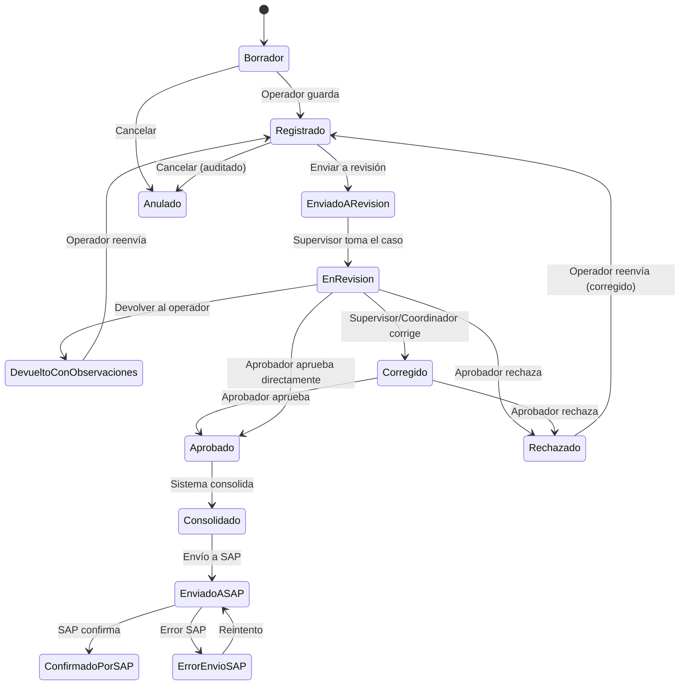

# Flujo de Aprobación — Global Avícola

> **Documento:** 12-approval-workflow.md
> **Versión:** 1.0.0
> **Fecha:** 2026-06-22

---

## 1. PRINCIPIO

> **Ningún dato operativo llega a SAP sin pasar por revisión, corrección (si aplica) y aprobación formal.**

El flujo de aprobación es el corazón del sistema. Separa las responsabilidades de registro, revisión y aprobación, garantizando calidad de datos, trazabilidad y control antes de que la información llegue al sistema contable (SAP).

---

## 2. FLUJO COMPLETO



---

## 3. ACTORES Y RESPONSABILIDADES

| Actor | Responsabilidad | Acciones permitidas |
|---|---|---|
| **Operador** | Registrar datos operativos en campo | Crear, Editar (antes de enviar), Enviar a revisión |
| **Supervisor** | Revisar calidad de datos | Revisar, Devolver con observaciones, Corregir (si está autorizado) |
| **Coordinador / Aprobador** | Aprobación formal | Aprobar, Rechazar (con motivo), Corregir |
| **Analista SAP** | Gestión de integración | Consolidar, Enviar a SAP, Gestionar errores |
| **Auditor** | Verificación de trazabilidad | Consultar auditoría (solo lectura) |
| **Administrador** | Configuración del flujo | Configurar niveles de aprobación, designar aprobadores |

---

## 4. ESTADOS DEL REGISTRO OPERATIVO

| # | Estado | Significado | ¿Quién puede mover? |
|---|---|---|---|
| 1 | **Borrador** | El operador empezó a llenar pero no terminó | Operador |
| 2 | **Registrado** | El operador guardó el registro | Operador → Envía a revisión |
| 3 | **Enviado a Revisión** | El registro está en la bandeja de revisión | Supervisor → Toma el caso |
| 4 | **En Revisión** | El supervisor está revisando | Supervisor → Devuelve, Corrige; Aprobador → Aprueba, Rechaza |
| 5 | **Devuelto con Observaciones** | El supervisor encontró problemas, el operador debe corregir | Operador → Corrige y reenvía |
| 6 | **Corregido** | Un usuario autorizado corrigió el registro (original conservado) | Aprobador → Aprueba o Rechaza |
| 7 | **Aprobado** | El registro fue aprobado formalmente | Sistema → Consolida |
| 8 | **Rechazado** | El registro fue rechazado (motivo obligatorio) | Operador → Reenvía (corregido) |
| 9 | **Consolidado** | El registro fue agrupado para envío a SAP | Analista SAP → Envía a SAP |
| 10 | **Enviado a SAP** | El payload fue enviado a SAP, esperando respuesta | Sistema → Procesa respuesta |
| 11 | **Confirmado por SAP** | SAP confirmó recepción | Estado final |
| 12 | **Error de Envío SAP** | SAP devolvió error | Analista SAP → Investiga y reenvía |
| 13 | **Anulado** | Registro cancelado con auditoría | Solo administrador (requiere motivo) |

---

## 5. CONFIGURACIÓN DE NIVELES DE APROBACIÓN

El sistema soporta aprobación multinivel configurable por empresa:

### Nivel 1 (Básico)
```
Operador registra → Supervisor/Coordinador APRUEBA → SAP
```
- Aprobación en un solo paso
- El supervisor puede revisar y aprobar

### Nivel 2 (Estándar)
```
Operador registra → Supervisor REVISA → Coordinador APRUEBA → SAP
```
- Revisión y aprobación segregadas
- El supervisor revisa pero no aprueba
- El coordinador aprueba formalmente

### Nivel 3 (Avanzado)
```
Operador registra → Supervisor REVISA → Coordinador APRUEBA → Gerente CONFIRMA → SAP
```
- Máximo control
- Tres niveles de verificación antes de SAP

### Configuración por empresa:
```json
{
  "approval_config": {
    "levels": 2,
    "steps": [
      {
        "step": 1,
        "name": "Revisión",
        "role": "supervisor",
        "can_correct": true,
        "can_approve": false,
        "can_reject": false
      },
      {
        "step": 2,
        "name": "Aprobación",
        "role": "approver",
        "can_correct": true,
        "can_approve": true,
        "can_reject": true
      }
    ],
    "require_segregation": true,
    "auto_consolidate": true
  }
}
```

---

## 6. REGLAS DE APROBACIÓN

| # | Regla |
|---|---|
| R1 | El operador NO puede aprobar sus propios registros (si segregación activa) |
| R2 | El supervisor que corrige NO puede aprobar el mismo registro (si configuración lo exige) |
| R3 | Todo rechazo requiere motivo obligatorio |
| R4 | Toda corrección conserva valor original + valor corregido |
| R5 | Una vez enviado a SAP, el registro no puede editarse |
| R6 | Solo registros en estado "Aprobado" pueden consolidarse |
| R7 | Un lote no puede cerrarse si tiene registros sin aprobar |
| R8 | La consolidación es atómica: todos los registros del lote se consolidan juntos |
| R9 | Los envíos a SAP son idempotentes (no se envía dos veces el mismo movimiento) |

---

## 7. CENTRO DE REVISIÓN OPERATIVA (UI)

### 7.1 Bandeja de revisión (vista web)

```
┌─────────────────────────────────────────────────────────┐
│  CENTRO DE REVISIÓN OPERATIVA                            │
│                                                          │
│  Filtros: [Granja ▼] [Lote ▼] [Fecha ▼] [Estado ▼]     │
│                                                          │
│  ┌────┬────────┬──────────┬──────────┬────────┬──────┐  │
│  │ ID │ Lote   │ Tipo     │ Operador │ Fecha  │ Est. │  │
│  ├────┼────────┼──────────┼──────────┼────────┼──────┤  │
│  │ 142│ L-001  │ Alimento │ J. Pérez │ 22/06  │ 📋   │  │
│  │ 143│ L-001  │ Pesaje   │ M. López │ 22/06  │ 📋   │  │
│  │ 144│ L-002  │ Mortal.  │ J. Pérez │ 21/06  │ 🔍   │  │
│  └────┴────────┴──────────┴──────────┴────────┴──────┘  │
│                                                          │
│  [Revisar seleccionados] [Aprobar lote] [Exportar]       │
└─────────────────────────────────────────────────────────┘
```

### 7.2 Vista de detalle de revisión

```
┌─────────────────────────────────────────────────────────┐
│  REVISIÓN: Registro de Alimento #142                     │
│  Lote: L-001 | Granja: La Esperanza | Galpón: G-3       │
│                                                          │
│  ┌─── DATOS ORIGINALES ────┐  ┌─── REFERENCIA SAP ────┐ │
│  │ Fecha: 22/06/2026       │  │ Orden: PO-4500012345  │ │
│  │ Tipo: Iniciador         │  │ Cant. esperada: 500kg │ │
│  │ Cantidad: 480 kg        │  │ Centro: C001          │ │
│  │ Operador: Juan Pérez    │  │ Almacén: ALM01        │ │
│  └─────────────────────────┘  └───────────────────────┘ │
│                                                          │
│  📊 COMPARACIÓN: Esperado SAP 500kg | Registrado 480kg   │
│     Diferencia: -20kg (4%)                               │
│                                                          │
│  [✓ APROBAR]  [✎ CORREGIR]  [↩ DEVOLVER]  [✗ RECHAZAR]  │
└─────────────────────────────────────────────────────────┘
```

---

## 8. CORRECCIÓN AUDITADA

### 8.1 Formulario de corrección

```
┌─────────────────────────────────────────────────────────┐
│  CORREGIR REGISTRO #142                                  │
│                                                          │
│  Campo: Cantidad                                         │
│  ┌──────────────────────────────────────────────────┐   │
│  │ Valor original: 480 kg        (Operador)          │   │
│  │ Valor corregido: [____] kg    (Tú)                │   │
│  └──────────────────────────────────────────────────┘   │
│                                                          │
│  Motivo de corrección: [▼ Error de digitación]          │
│  Observaciones: [__________________________________]    │
│                                                          │
│  ⚠️ Esta corrección quedará registrada en auditoría.    │
│                                                          │
│  [GUARDAR CORRECCIÓN]  [CANCELAR]                        │
└─────────────────────────────────────────────────────────┘
```

---

## 9. APROBACIÓN POR LOTES

Para eficiencia, el sistema permite aprobar múltiples registros a la vez:

1. Seleccionar registros (checkboxes)
2. Revisar lista de seleccionados
3. Confirmar acción (Aprobar todos / Rechazar todos)
4. Si es rechazo → motivo obligatorio que aplica a todos
5. Se genera un ApprovalAction por cada registro individual

---

## 10. CONSOLIDACIÓN

### Proceso automático (configurable)

1. Todos los registros de un lote/período en estado "Aprobado"
2. Sistema agrupa por tipo de movimiento
3. Valida integridad:
   - Totales cuadran
   - Referencias SAP existen
   - No hay registros huérfanos
4. Genera ConsolidatedMovement
5. Prepara SapPayload
6. Deja listo para envío (o envía automáticamente)

---

## 11. AUDITORÍA DEL FLUJO DE APROBACIÓN

Cada transición de estado genera un registro de auditoría:

```
Registro #142 — Trazabilidad completa
━━━━━━━━━━━━━━━━━━━━━━━━━━━━━━━━━━━━━━━━━━━━━━━━
22/06/2026 08:15  Juan Pérez (Operador)     CREÓ
22/06/2026 08:16  Sistema                   ENVIADO A REVISIÓN
22/06/2026 09:30  María Ríos (Supervisora)  INICIÓ REVISIÓN
22/06/2026 09:35  María Ríos (Supervisora)  CORRIGIÓ
                   └ Cantidad: 480 → 500 kg
                   └ Motivo: Error de digitación
22/06/2026 09:36  Carlos Ruiz (Aprobador)   APROBÓ
22/06/2026 10:00  Sistema                   CONSOLIDADO
22/06/2026 10:05  Sistema                   ENVIADO A SAP
22/06/2026 10:06  SAP                       CONFIRMADO (#SAP-998877)
━━━━━━━━━━━━━━━━━━━━━━━━━━━━━━━━━━━━━━━━━━━━━━━━
```
