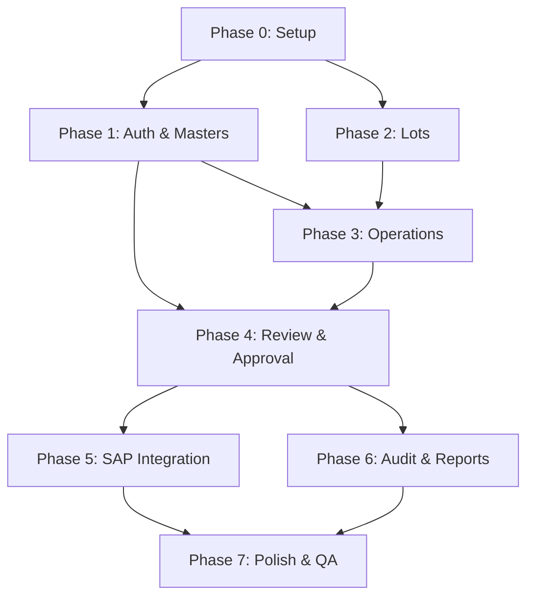

# Implementation Plan: Global Avícola

**Branch**: `main` | **Date**: 2026-06-22 | **Spec**: [spec.md](./spec.md)

**Input**: Feature specification from `/specs/global-avicola/spec.md`

---

## Summary

Global Avícola es una plataforma empresarial web/mobile-first para la gestión operativa integral del ciclo productivo avícola (abuelas, reproductoras cría, reproductoras producción, incubación y engorde), funcionando como capa auxiliar operativa de SAP. El sistema implementa un flujo obligatorio de registro → revisión → corrección → aprobación → consolidación → envío a SAP, con trazabilidad y auditoría completas. Tech stack: React 18 + Vite + TypeScript + TailwindCSS (frontend), FastAPI + Python 3.11+ + SQLAlchemy 2.x + PostgreSQL (backend).

## Technical Context

**Language/Version**: Python 3.11+ (backend), TypeScript 5.5+ (frontend)

**Primary Dependencies**: FastAPI 0.110+, SQLAlchemy 2.x (async), Alembic, Pydantic v2, PyJWT, Uvicorn (backend); React 18.3+, Vite 5.4+, TailwindCSS 3.4+, React Router 6.26+, Zustand 4.5+, react-i18next 14+, Zod, TanStack Table, Recharts, Axios (frontend)

**Storage**: PostgreSQL 15+ (async via asyncpg + SQLAlchemy)

**Testing**: Pytest + HTTPX (backend), Vitest + React Testing Library (frontend unit), Playwright (E2E cross-browser)

**Target Platform**: Linux server (Docker), Web browsers (Chrome, Edge, Firefox, Safari, Opera, iOS Safari, Android Chrome), Mobile-first responsive

**Project Type**: Web application (SPA frontend + REST API backend)

**Performance Goals**: Mobile load < 3s on 4G, form completion < 60s, API response < 200ms p95

**Constraints**: < 500KB initial bundle (gzipped), > 80% backend test coverage, > 70% frontend coverage, 100% i18n coverage (ES/EN)

**Scale/Scope**: 14 modules, ~80 API endpoints, 30+ database entities, 8 browser targets × 7 viewports, bilingual ES/EN

## Constitution Check

*GATE: Must pass before Phase 0 research. Re-check after Phase 1 design.*

| Principle | Status | Evidence |
|---|---|---|
| **I. Spec-Driven Development** | ✅ PASS | Spec created in `spec.md`, functional spec in `docs/02-functional-spec.md` |
| **II. SAP is the master system** | ✅ PASS | Adapter pattern design, no direct SAP coupling, manual mode initial |
| **III. Audit everything** | ✅ PASS | `AuditLog` model immutable, every action tracked, correction preserves originals |
| **IV. Mobile-first real** | ✅ PASS | TailwindCSS mobile-first breakpoints, 44px touch targets, bottom nav |
| **V. No legacy code migration** | ✅ PASS | Conceptual extraction only, full redesign with modern stack |
| **VI. Bilingual from start** | ✅ PASS | react-i18next with JSON translation files, selector visible |
| **VII. Test before implement** | ✅ PASS | Pytest + Playwright matrix defined in QA plan |
| **VIII. Clean architecture** | ✅ PASS | Modular by domain: routers/schemas/services/models per module |

## Project Structure

### Documentation (this feature)

```text
specs/global-avicola/
├── spec.md              # Feature specification (Spec Kit format)
├── plan.md              # This file (/speckit.plan command output)
├── research.md          # Phase 0 output
├── data-model.md        # Phase 1 output
├── quickstart.md        # Phase 1 output
├── contracts/           # Phase 1 output (OpenAPI + API contracts)
│   └── api-contract.md
└── tasks.md             # Phase 2 output (/speckit.tasks command)
```

### Source Code (repository root)

```text
global-avicola/
├── README.md
├── Makefile
├── docker-compose.yml
├── .env.example
├── .github/workflows/
│   ├── backend-ci.yml
│   ├── frontend-ci.yml
│   └── e2e.yml
│
├── docs/                        # 14 specification documents
│   ├── 00-product-vision.md
│   ├── 01-legacy-audit.md
│   ├── 02-functional-spec.md
│   ├── 03-domain-model.md
│   ├── 04-technical-plan.md
│   ├── 05-migration-plan.md
│   ├── 06-api-contract.md
│   ├── 07-qa-plan.md
│   ├── 08-browser-compatibility-plan.md
│   ├── 09-i18n-plan.md
│   ├── 10-sap-integration-strategy.md
│   ├── 11-ui-ux-design-system.md
│   ├── 12-approval-workflow.md
│   └── 13-audit-strategy.md
│
├── backend/
│   ├── Dockerfile
│   ├── alembic.ini
│   ├── pyproject.toml
│   ├── alembic/
│   │   ├── env.py
│   │   └── versions/
│   ├── app/
│   │   ├── main.py              # FastAPI app factory
│   │   ├── config.py            # Settings (pydantic-settings)
│   │   ├── database.py          # SQLAlchemy engine + session
│   │   ├── dependencies.py      # FastAPI dependencies (auth, db)
│   │   ├── auth/                # JWT + RBAC
│   │   │   ├── models.py
│   │   │   ├── schemas.py
│   │   │   ├── service.py
│   │   │   ├── router.py
│   │   │   └── security.py
│   │   ├── masters/             # Company, Farm, House, Hatchery, etc.
│   │   ├── lots/                # Lot, LotPhase, OpeningBalance
│   │   ├── operations/          # OperationalEvent + movements
│   │   ├── review/              # ReviewBatch, ApprovalStep
│   │   ├── corrections/         # CorrectionLog
│   │   ├── approvals/           # ApprovalAction
│   │   ├── consolidation/       # ConsolidatedMovement
│   │   ├── audit/               # AuditLog
│   │   ├── reports/             # KPIs, reports
│   │   ├── dashboard/           # Dashboard data
│   │   └── integrations/sap/    # SAP adapter, sync, payloads
│   ├── seeds/                   # Development seeds
│   └── tests/                   # pytest (unit + integration)
│       ├── conftest.py
│       ├── test_auth/
│       ├── test_masters/
│       ├── test_lots/
│       ├── test_operations/
│       ├── test_review/
│       ├── test_approvals/
│       ├── test_audit/
│       └── test_sap_integration/
│
└── frontend/
    ├── Dockerfile
    ├── nginx.conf
    ├── package.json
    ├── vite.config.ts
    ├── tsconfig.json
    ├── tailwind.config.ts
    ├── index.html
    ├── public/locales/
    │   ├── es/translation.json
    │   └── en/translation.json
    ├── src/
    │   ├── main.tsx
    │   ├── App.tsx
    │   ├── i18n/
    │   ├── components/
    │   │   ├── ui/              # Button, Input, Card, Table, Modal, Badge
    │   │   ├── layout/          # Sidebar, Header, MobileNav
    │   │   ├── forms/           # FormField, Select, DatePicker
    │   │   ├── data-table/      # Data table with filters/pagination
    │   │   └── approval/        # Approval workflow components
    │   ├── pages/
    │   │   ├── auth/            # Login, ForgotPassword
    │   │   ├── dashboard/       # Mobile + Admin dashboards
    │   │   ├── masters/         # CRUD pages
    │   │   ├── lots/            # Lot list, detail, activation
    │   │   ├── operations/      # All operational forms
    │   │   ├── review/          # Review center, correction
    │   │   ├── approvals/       # Approval panel
    │   │   ├── sap/             # SAP sync, errors
    │   │   ├── audit/           # Audit log viewer
    │   │   ├── reports/         # KPIs, reports
    │   │   ├── users/           # User & role management
    │   │   └── settings/        # Profile, company settings
    │   ├── hooks/               # Custom hooks
    │   ├── services/            # API clients
    │   ├── stores/              # Zustand stores
    │   ├── types/               # TypeScript types
    │   └── styles/              # Global CSS
    └── tests/
        ├── unit/
        └── e2e/
```

## Implementation Phases

### Phase 0: Project Setup (Foundation)
**Goal**: Runnable project skeleton with CI/CD

- [ ] Initialize backend project (FastAPI + SQLAlchemy + Alembic + Pytest)
- [ ] Initialize frontend project (React + Vite + TypeScript + TailwindCSS)
- [ ] Docker Compose with PostgreSQL, backend, frontend services
- [ ] GitHub Actions CI/CD pipelines (lint, test, typecheck)
- [ ] Alembic initial migration
- [ ] Development seeds
- [ ] `.env.example` and configuration

### Phase 1: Auth & Masters (Core)
**Goal**: Authentication, authorization, and master data CRUD

- [ ] JWT authentication (login, refresh, logout)
- [ ] RBAC system (roles, permissions, user-role assignment)
- [ ] User management CRUD
- [ ] Master data CRUD (companies, farms, houses, hatcheries, genetic lines, breeds, suppliers, feed types, vaccines, etc.)
- [ ] i18n setup (ES/EN) with translation files
- [ ] Layout components (sidebar, header, mobile nav)

### Phase 2: Lots & Opening Balance (Domain Core)
**Goal**: Lot lifecycle management

- [ ] Lot CRUD (create, read, update, close)
- [ ] Lot phases and transitions
- [ ] Manual lot activation with opening balance
- [ ] Lot balances (calculated from events)
- [ ] Lot list with filters and detail view

### Phase 3: Operational Events (Field Data Capture)
**Goal**: Mobile-first operational data entry

- [ ] Bird reception & distribution forms
- [ ] Feed registration form
- [ ] Weight recording form
- [ ] Mortality recording form (with business rule validation)
- [ ] Vaccination & medication forms
- [ ] Egg collection & classification forms
- [ ] Egg dispatch to hatchery form
- [ ] Incubation load, ovoscopy, transfer, birth forms
- [ ] Chick dispatch to broiler form
- [ ] Farm & transport inspection forms
- [ ] Grandparent importation form
- [ ] Bird exit & lot closure forms
- [ ] All business rules enforced (BR-01 through BR-16)

### Phase 4: Review & Approval (Differentiator)
**Goal**: Central review center with correction and multilevel approval

- [ ] Review center / pending tray with advanced filters
- [ ] Review detail view (side-by-side: original vs SAP reference)
- [ ] Correction with audit (original + corrected + reason)
- [ ] Return to operator with observations
- [ ] Approval workflow (configurable 1/2/3 levels)
- [ ] Batch approval (by lot, by period)
- [ ] Rejection with mandatory reason
- [ ] Consolidation of approved movements

### Phase 5: SAP Integration
**Goal**: SAP reference management and controlled export

- [ ] SAP reference import (manual CSV/JSON upload)
- [ ] SAP reference management UI
- [ ] Adapter pattern: Manual adapter + Mock adapter
- [ ] Payload generation for SAP
- [ ] Idempotency (SHA-256 key)
- [ ] SAP sync job tracking (SapSyncJob, SapPayload, SapResponse)
- [ ] Retry with exponential backoff
- [ ] SAP error management UI

### Phase 6: Audit & Reports
**Goal**: Complete audit trail and reporting

- [ ] Automatic audit logging (SQLAlchemy event listeners)
- [ ] Audit log viewer with advanced filters
- [ ] Record timeline view (who did what, when)
- [ ] KPI reports (mortality, feed conversion, egg production, hatchery yield)
- [ ] Lot complete report
- [ ] SAP comparison report
- [ ] Export to Excel/PDF

### Phase 7: Polish & QA
**Goal**: Production readiness

- [ ] Full test coverage (unit + integration + E2E)
- [ ] Cross-browser testing (8 browsers × 7 viewports)
- [ ] i18n validation (100% coverage ES/EN)
- [ ] Permission matrix testing
- [ ] Business rules validation testing
- [ ] Performance optimization
- [ ] Accessibility audit
- [ ] Security review

## Technical Decisions

| Decision | Choice | Rationale |
|---|---|---|
| Backend async | Yes (asyncpg + SQLAlchemy async) | Higher throughput for I/O bound operations |
| ORM | SQLAlchemy 2.x | Most mature Python ORM, async support in 2.x |
| Validation | Pydantic v2 | FastAPI native, fast, typed |
| Frontend state | Zustand | Simpler than Redux, better TS support |
| CSS framework | TailwindCSS (package) | No CDN, utility-first, fast development |
| Forms | React Hook Form + Zod | Performance (uncontrolled) + typed validation |
| Tables | TanStack Table | Headless, flexible, Tailwind compatible |
| Charts | Recharts | React native, lightweight |
| SAP integration | Adapter pattern | Decoupled, swappable mechanism |
| Database model | Unified (not duplicated by phase) | DRY, maintainable, consistent |
| Soft delete | Yes (all entities) | Audit trail, no data loss |
| i18n | react-i18next | Standard, lazy loading |

## Risk Mitigation

| Risk | Mitigation |
|---|---|
| SAP not accessible for testing | Mock adapter, manual mode initial |
| Business rules not documented in legacy | Extracted from code audit + functional interviews |
| Complex approval workflow | Modeled as configurable state machine, not hardcoded |
| Legacy technical debt migration | No code migration — conceptual extraction only |
| Flutter as only functional reference | Full audit of screens/forms/flows completed |
| Cross-browser compatibility | Playwright matrix with 8 browsers |
| i18n implemented late | Implemented from Phase 1, not retrofitted |

## Dependencies


