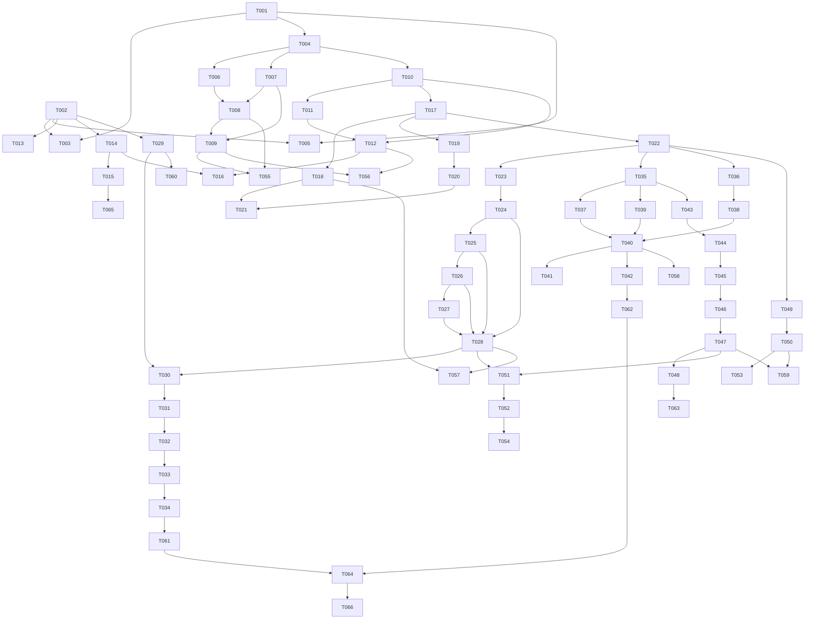

# Tasks — Global Avícola

> **Spec Kit:** `/speckit.tasks` Phase 2 output
> **Derived from:** [plan.md](./plan.md)
> **Date:** 2026-06-22
> **Last Updated:** 2026-06-24
> **Total Tasks:** 83+

---

## Implementation Status — 2026-06-24

Estado real de la implementación tras auditoría del código fuente.

| Fase | Descripción | Estado | Notas |
|------|-------------|--------|-------|
| **Phase 0** | Project Setup | ✅ Completo | Docker, Alembic, pyproject, vite config |
| **Phase 1 Backend** | Auth + Masters CRUD API | ✅ Completo | JWT, RBAC básico, 19 catálogos con CRUD |
| **Phase 1 Frontend** | Login, Layout, i18n, Masters lista | 🔶 Parcial | i18n ✅, Layout ✅, Masters solo lista (sin forms crear/editar) |
| **Phase 2** | Lots + Opening Balance | ✅ Completo | Backend + LotListPage + LotDetailPage básico |
| **Phase 3 Backend** | 24 EventTypes + Business Rules | ✅ Completo | Models, services, router con filtros |
| **Phase 3 Frontend** | Operation forms | 🔶 Parcial | OperationFormPage (24 tipos) ✅, pero STAGE_OPERATIONS incompleto en LotDetailPage |
| **Phase 4** | Review + Approval + Corrections | ✅ Completo | Backend + frontend ReviewCenter, ApprovalPanel, CorrectionForm |
| **Phase 5** | SAP Integration | ✅ Completo | Backend adapter + SapManagerPage |
| **Phase 6** | Audit + Reports + Dashboard | 🔶 Parcial | AuditPage ✅, ReportsPage ✅, KPI endpoints ✅, sin export PDF/Excel, Dashboard básico |
| **Phase 7** | QA Tests | 🔶 Parcial | Backend tests básicos (auth, ops, review, sap). Frontend sin tests. Sin E2E. |

### Gaps Críticos Identificados (a resolver en Phase 8)

| ID | Severidad | Gap | Archivo/Módulo |
|----|-----------|-----|----------------|
| **G-01** | 🔴 | `STAGE_OPERATIONS` incompleto — grandparent sin egg ops ni transport_inspection ni cull_recording | `LotDetailPage.tsx` |
| **G-02** | 🔴 | `STAGE_OPERATIONS` breeder no diferencia fase cría vs producción | `LotDetailPage.tsx` |
| **G-03** | 🔴 | `STAGE_OPERATIONS` broiler falta bird_distribution, cull_recording, transport_inspection, bird_exit | `LotDetailPage.tsx` |
| **G-04** | 🔴 | `STAGE_OPERATIONS` hatchery no existe en absoluto | `LotDetailPage.tsx` |
| **G-05** | 🔴 | `BirdTypeEnum` no tiene `hatchery` — la incubadora no puede ser un tipo de lote | `masters/models.py` |
| **G-06** | 🟡 | Masters CRUD: solo listas, sin formularios crear/editar en frontend | `MasterListPage.tsx` |
| **G-07** | 🟡 | No existe UI para crear nuevo lote (formulario + activación manual) | `lots/` |
| **G-08** | 🟡 | No existe UI para transición de fase (cría → producción) | `LotDetailPage.tsx` |
| **G-09** | 🟡 | Design system no aplicado — ad-hoc Tailwind, emojis en lugar de iconos, sin componentes reutilizables | `components/`, `index.css` |
| **G-10** | 🟡 | Dashboard básico — sin KPIs por etapa, sin gráficas de tendencia | `DashboardPage.tsx` |
| **G-11** | 🟡 | Sin exportación PDF/Excel en reportes | `reports/` |
| **G-12** | 🟡 | Sin página "Mis Pendientes" para operadores móviles | `operations/` |
| **G-13** | 🟡 | Sin hamburger/drawer en Header móvil | `Header.tsx` |

---

## Phase 0: Project Setup (Foundation)

### T-001: Initialize Backend Project
- Create FastAPI app factory in `backend/app/main.py`
- Configure `pyproject.toml` with dependencies
- Set up `backend/app/config.py` with pydantic-settings
- Create `backend/app/database.py` with async SQLAlchemy engine + session
- Configure logging with structlog
- **Files:** `backend/pyproject.toml`, `backend/app/main.py`, `backend/app/config.py`, `backend/app/database.py`
- **Depends on:** None

### T-002: Initialize Frontend Project
- Create React+Vite+TypeScript project in `frontend/`
- Configure `vite.config.ts` with proxy to backend
- Configure `tailwind.config.ts` with design system colors
- Configure `tsconfig.json` with strict mode + path aliases
- Set up `index.html` with Inter font
- **Files:** `frontend/package.json`, `frontend/vite.config.ts`, `frontend/tailwind.config.ts`, `frontend/tsconfig.json`, `frontend/index.html`
- **Depends on:** None

### T-003: Docker Compose Setup
- Create `docker-compose.yml` with PostgreSQL, backend, frontend services
- Create `backend/Dockerfile` (Python 3.11, uvicorn)
- Create `frontend/Dockerfile` (multi-stage: dev + nginx prod)
- Create `frontend/nginx.conf`
- Create `.env.example`
- **Files:** `docker-compose.yml`, `backend/Dockerfile`, `frontend/Dockerfile`, `frontend/nginx.conf`, `.env.example`
- **Depends on:** T-001, T-002

### T-004: Alembic Initial Migration
- Configure `alembic.ini` with database URL from env
- Create `backend/alembic/env.py` with async support
- Create initial migration for all core models
- **Files:** `backend/alembic.ini`, `backend/alembic/env.py`, `backend/alembic/versions/001_initial.py`
- **Depends on:** T-001

### T-005: CI/CD Pipelines
- Create `backend-ci.yml`: lint (ruff), test (pytest), typecheck (mypy)
- Create `frontend-ci.yml`: lint (eslint), test (vitest), typecheck (tsc), build
- Create `e2e.yml`: Playwright cross-browser tests
- **Files:** `.github/workflows/backend-ci.yml`, `.github/workflows/frontend-ci.yml`, `.github/workflows/e2e.yml`
- **Depends on:** T-001, T-002

---

## Phase 1: Auth & Masters (Core)

### T-006: JWT Authentication Module
- Create `backend/app/auth/security.py` (password hashing, JWT create/verify)
- Create `backend/app/auth/schemas.py` (LoginRequest, TokenResponse, UserRead)
- Create `backend/app/auth/service.py` (authenticate, refresh, get_current_user)
- Create `backend/app/auth/router.py` (POST /auth/login, /auth/refresh, /auth/logout, GET /auth/me)
- Create `backend/app/dependencies.py` (get_current_user dependency)
- **Files:** `backend/app/auth/*`, `backend/app/dependencies.py`
- **Depends on:** T-004

### T-007: User & Role Models
- Create `backend/app/auth/models.py` (User, Role, Permission SQLAlchemy models)
- Create `backend/app/auth/schemas.py` (UserCreate, UserUpdate, RoleCreate, RoleUpdate)
- **Depends on:** T-004

### T-008: User Management CRUD
- Create `backend/app/auth/service.py` (CRUD users, assign roles)
- Create `backend/app/auth/router.py` (user CRUD endpoints)
- **Depends on:** T-007

### T-009: Role & Permission Management
- Create role CRUD endpoints
- Create permission assignment endpoints
- Implement RBAC dependency (check permission before endpoint execution)
- **Depends on:** T-007, T-008

### T-010: Master Data Models (Part 1)
- Company, Farm, House, Hatchery, Incubator, Hatcher models
- GeneticLine, Breed, BirdType, ProductivePhase models
- Schemas (Pydantic) for all models
- **Files:** `backend/app/masters/models.py`, `backend/app/masters/schemas.py`
- **Depends on:** T-004

### T-011: Master Data Models (Part 2)
- Supplier, FeedType, Vaccine, Medication models
- MortalityCause, CullCause, Transport, ProcessingPlant models
- RejectionReason, CorrectionType models
- **Files:** `backend/app/masters/models.py` (continued)
- **Depends on:** T-010

### T-012: Master Data CRUD Endpoints
- Create service layer for all master entities
- Create router with CRUD endpoints for each entity
- Add pagination and search support
- **Files:** `backend/app/masters/service.py`, `backend/app/masters/router.py`
- **Depends on:** T-010, T-011

### T-013: Frontend Auth Pages
- Create `LoginPage.tsx` with form (React Hook Form + Zod validation)
- Create `ForgotPasswordPage.tsx`
- Implement auth store (Zustand)
- Implement axios interceptor (attach JWT, handle 401 refresh)
- **Files:** `frontend/src/pages/auth/*`, `frontend/src/stores/auth.store.ts`, `frontend/src/services/api.ts`
- **Depends on:** T-002

### T-014: Frontend Layout Components
- Create `Sidebar.tsx` (desktop navigation, azul corporativo)
- Create `Header.tsx` (top bar with user menu, language selector)
- Create `MobileNav.tsx` (bottom navigation for mobile)
- Create `AppLayout.tsx` (responsive layout wrapper)
- **Files:** `frontend/src/components/layout/*`
- **Depends on:** T-002

### T-015: Frontend i18n Setup
- Install and configure react-i18next
- Create `public/locales/es/translation.json` with all Spanish strings
- Create `public/locales/en/translation.json` with all English strings
- Add language selector to Header
- **Files:** `frontend/src/i18n/*`, `public/locales/*`
- **Depends on:** T-014

### T-016: Frontend Master Data Pages
- Create CRUD pages for Farms, Houses, Hatcheries
- Create list pages for GeneticLines, Breeds, Suppliers, FeedTypes, Vaccines
- Implement reusable data table component (TanStack Table + Tailwind)
- **Files:** `frontend/src/pages/masters/*`, `frontend/src/components/data-table/*`
- **Depends on:** T-012, T-014

---

## Phase 2: Lots & Opening Balance (Domain Core)

### T-017: Lot & Phase Models
- Create Lot, LotPhase SQLAlchemy models
- Create schemas (Pydantic)
- Create Alembic migration for lot tables
- **Files:** `backend/app/lots/models.py`, `backend/app/lots/schemas.py`
- **Depends on:** T-010

### T-018: Lot CRUD Service & Endpoints
- Create lot service (create, read, update, close, calculate balances)
- Create lot router (CRUD + close endpoint)
- Implement lot balance calculation (derived from events)
- **Files:** `backend/app/lots/service.py`, `backend/app/lots/router.py`
- **Depends on:** T-017

### T-019: Opening Balance Model & Logic
- Create OpeningBalance SQLAlchemy model
- Create opening balance schemas
- Implement manual lot activation logic
- Audit trail for manual activation
- **Files:** `backend/app/lots/models.py` (OpeningBalance)
- **Depends on:** T-017

### T-020: Opening Balance Endpoints
- POST /lots/activate-manual endpoint
- GET /lots/{id}/balances endpoint
- Validate business rules (no double activation, valid dates)
- Generate opening balance report
- **Depends on:** T-019

### T-021: Frontend Lot Pages
- Create `LotListPage.tsx` with filters (farm, phase, status)
- Create `LotDetailPage.tsx` with phases, balances, events summary
- Create `LotActivationPage.tsx` (manual activation form + opening balance)
- **Files:** `frontend/src/pages/lots/*`
- **Depends on:** T-018, T-020

---

## Phase 3: Operational Events (Field Data Capture)

### T-022: OperationalEvent Core Model
- Create OperationalEvent SQLAlchemy model (unified with event_type discriminator)
- Create BirdMovement, EggMovement, FeedMovement, HatcheryMovement models
- Create schemas (Pydantic) for all event types
- Create Alembic migration
- **Files:** `backend/app/operations/models.py`, `backend/app/operations/schemas.py`
- **Depends on:** T-017

### T-023: Business Rules Engine
- Implement BR-01: Mortality ≤ available balance
- Implement BR-02: Egg dispatch ≤ available
- Implement BR-03: Incubation load ≤ eggs received
- Implement BR-04: Chick dispatch ≤ hatched viable
- Implement BR-06: Event date ≥ lot activation date
- Implement BR-07: Lot must be active
- Implement BR-08: Farm/house required where applicable
- **Files:** `backend/app/operations/validators.py`
- **Depends on:** T-022

### T-024: Operation Services (Part 1 - Bird & Feed)
- Bird reception/distribution/transfer/exit service
- Feed registration service
- Weight recording service
- **Files:** `backend/app/operations/service.py`
- **Depends on:** T-022, T-023

### T-025: Operation Services (Part 2 - Mortality & Health)
- Mortality recording service
- Cull recording service
- Vaccination service
- Medication service
- **Depends on:** T-024

### T-026: Operation Services (Part 3 - Eggs & Hatchery)
- Egg collection/classification/dispatch service
- Egg reception at hatchery service
- Incubation load/ovoscopy/transfer/birth service
- Chick dispatch service
- **Depends on:** T-025

### T-027: Operation Services (Part 4 - Inspections & Import)
- Farm inspection service
- Transport inspection service
- Hatchery inspection service
- Grandparent importation service
- Lot closure service
- **Depends on:** T-026

### T-028: Operation Router & Endpoints
- Create unified operations router with all POST endpoints
- GET /operations with advanced filters
- GET /operations/{id}
- PUT /operations/{id} (draft/registered only)
- POST /operations/{id}/submit (to review)
- DELETE /operations/{id} (soft delete, audited)
- **Files:** `backend/app/operations/router.py`
- **Depends on:** T-024, T-025, T-026, T-027

### T-029: Frontend UI Components
- Create Button, Input, Select, DatePicker, TextArea components
- Create Card, Badge, Modal, Toast components
- Create FormField wrapper with error display
- Apply TailwindCSS design system (colors, typography, spacing)
- **Files:** `frontend/src/components/ui/*`
- **Depends on:** T-002

### T-030: Frontend Operation Forms (Part 1)
- BirdReception form + BirdDistribution form
- FeedRegistration form
- WeightRecording form
- Implement React Hook Form + Zod schemas
- Mobile-first responsive design
- **Files:** `frontend/src/pages/operations/*`
- **Depends on:** T-028, T-029

### T-031: Frontend Operation Forms (Part 2)
- MortalityRecording form (with balance validation)
- VaccinationRecording form
- MedicationRecording form
- FarmInspection form
- **Depends on:** T-030

### T-032: Frontend Operation Forms (Part 3)
- EggCollection + EggClassification forms
- EggDispatch form
- EggReceptionHatchery form
- **Depends on:** T-031

### T-033: Frontend Operation Forms (Part 4)
- IncubationLoad + Ovoscopy + TransferToHatcher forms
- BirthRegistration + ChickDispatch forms
- **Depends on:** T-032

### T-034: Frontend Operation Forms (Part 5)
- BirdExit form
- GrandparentImport form
- LotClosure form
- TransportInspection form
- HatcheryInspection form
- **Depends on:** T-033

---

## Phase 4: Review & Approval (Differentiator)

### T-035: ReviewBatch Model
- Create ReviewBatch, ApprovalStep, ApprovalAction SQLAlchemy models
- Create schemas (Pydantic)
- Create Alembic migration
- **Files:** `backend/app/review/models.py`, `backend/app/review/schemas.py`
- **Depends on:** T-022

### T-036: CorrectionLog Model
- Create CorrectionLog SQLAlchemy model
- Create schemas (Pydantic)
- Create Alembic migration
- **Files:** `backend/app/corrections/models.py`, `backend/app/corrections/schemas.py`
- **Depends on:** T-022

### T-037: Review Center Service
- Create review batch creation logic
- Implement pending events query (with all filters)
- Implement review start/complete flow
- Implement return to operator with observations
- **Files:** `backend/app/review/service.py`
- **Depends on:** T-035

### T-038: Correction Service
- Implement correction with audit (original value preserved)
- Validate correction authorization (role check)
- Generate correction audit log
- **Files:** `backend/app/corrections/service.py`
- **Depends on:** T-036

### T-039: Approval Service
- Implement approval workflow (configurable 1/2/3 levels)
- Implement segregation of duties check
- Implement batch approval logic
- Implement rejection with mandatory reason
- **Files:** `backend/app/approvals/service.py`
- **Depends on:** T-035

### T-040: Review & Approval Routers
- Review router (GET pending, POST batches, POST start/return/complete)
- Corrections router (POST correction, GET corrections)
- Approvals router (GET pending, POST approve/reject, POST batch-approve)
- **Files:** `backend/app/review/router.py`, `backend/app/corrections/router.py`, `backend/app/approvals/router.py`
- **Depends on:** T-037, T-038, T-039

### T-041: Frontend Review Center
- Create `ReviewCenter.tsx` (bandeja de revisión with filters)
- Create `ReviewDetail.tsx` (side-by-side: original vs SAP reference)
- Create `CorrectionForm.tsx` (original + corrected + reason)
- **Files:** `frontend/src/pages/review/*`
- **Depends on:** T-040

### T-042: Frontend Approval Panel
- Create `ApprovalPanel.tsx` (pending approvals with actions)
- Create `BatchApproval.tsx` (multi-select approve/reject)
- Create rejection reason modal
- **Files:** `frontend/src/pages/approvals/*`
- **Depends on:** T-040

---

## Phase 5: SAP Integration

### T-043: SAP Models
- Create SapReference, SapSyncJob, SapPayload, SapResponse SQLAlchemy models
- Create ConsolidatedMovement model
- Create schemas (Pydantic)
- Create Alembic migration
- **Files:** `backend/app/integrations/sap/models.py`, `backend/app/integrations/sap/schemas.py`
- **Depends on:** T-035

### T-044: SAP Adapter Interface
- Create abstract base class (ABC) for SAP adapter
- Define interface: import_masters, import_documents, export_consolidated, check_connection
- Create ManualSapAdapter (file-based import/export)
- Create MockSapAdapter (for development/testing)
- **Files:** `backend/app/integrations/sap/adapter.py`, `backend/app/integrations/sap/mock.py`
- **Depends on:** T-043

### T-045: SAP Import Service
- Implement CSV/JSON import with column mapping
- Implement data validation before import
- Implement record of each import (SapSyncJob)
- **Files:** `backend/app/integrations/sap/service.py`
- **Depends on:** T-044

### T-046: SAP Export & Consolidation Service
- Implement consolidation logic (group approved events by lot/period)
- Implement payload generation
- Implement idempotency (SHA-256 key)
- Implement retry with exponential backoff (3 attempts, 1min/5min/15min)
- **Depends on:** T-045

### T-047: SAP Router & Endpoints
- POST /sap/references/import
- GET /sap/references
- GET /sap/sync/jobs
- POST /sap/sync/export
- GET /sap/errors
- **Files:** `backend/app/integrations/sap/router.py`
- **Depends on:** T-046

### T-048: Frontend SAP Pages
- Create `SapReferencesPage.tsx` (import + list references)
- Create `SapSyncPanel.tsx` (sync jobs, trigger export)
- Create `SapErrorsPage.tsx` (error management, retry)
- **Files:** `frontend/src/pages/sap/*`
- **Depends on:** T-047

---

## Phase 6: Audit & Reports

### T-049: AuditLog Model & Service
- Create AuditLog SQLAlchemy model (immutable)
- Create schemas (Pydantic)
- Implement SQLAlchemy event listeners for automatic audit
- Implement audit query service with all filters
- **Files:** `backend/app/audit/models.py`, `backend/app/audit/service.py`
- **Depends on:** T-022

### T-050: Audit Router & Endpoints
- GET /audit with advanced filters
- GET /audit/{id}
- GET /audit/event/{event_id}/timeline
- **Files:** `backend/app/audit/router.py`
- **Depends on:** T-049

### T-051: Reports Service
- KPI calculations: mortality, feed conversion, egg production, hatchery yield
- Lot complete report
- SAP comparison report
- Export to Excel (openpyxl) and PDF (weasyprint)
- **Files:** `backend/app/reports/service.py`, `backend/app/dashboard/service.py`
- **Depends on:** T-028, T-047

### T-052: Reports & Dashboard Routers
- GET /dashboard/mobile (operator KPIs)
- GET /dashboard/admin (supervisor KPIs)
- GET /reports/lot/{id}
- GET /reports/kpis/*
- GET /reports/sap-comparison
- GET /reports/export/{type}
- **Files:** `backend/app/reports/router.py`, `backend/app/dashboard/router.py`
- **Depends on:** T-051

### T-053: Frontend Audit Viewer
- Create `AuditLogViewer.tsx` with advanced filters
- Create record timeline component
- Create value comparison component (previous vs new)
- **Files:** `frontend/src/pages/audit/*`
- **Depends on:** T-050

### T-054: Frontend Reports & Dashboards
- Create `MobileDashboard.tsx` (operator view)
- Create `AdminDashboard.tsx` (supervisor/admin KPIs with charts)
- Create `LotReport.tsx` (complete lot report)
- Create `KpiDashboard.tsx` (charts with Recharts)
- Create `SapComparisonReport.tsx`
- **Files:** `frontend/src/pages/reports/*`, `frontend/src/pages/dashboard/*`
- **Depends on:** T-052

### T-055: Frontend User & Role Management Pages
- Create `UserManagement.tsx` (CRUD table)
- Create `RoleManagement.tsx` (CRUD + permission assignment)
- Create `ProfilePage.tsx` + `CompanySettings.tsx`
- **Files:** `frontend/src/pages/users/*`, `frontend/src/pages/settings/*`
- **Depends on:** T-008, T-009

---

## Phase 7: Polish & QA

### T-056: Backend Unit Tests - Auth & Masters
- Test all auth endpoints (login, refresh, logout, me)
- Test RBAC (authorized vs unauthorized)
- Test all master data CRUD endpoints
- **Files:** `backend/tests/test_auth/*`, `backend/tests/test_masters/*`
- **Depends on:** T-009, T-012

### T-057: Backend Unit Tests - Lots & Operations
- Test lot creation, phases, activation, closure
- Test all operation types with valid and invalid data
- Test all business rules (BR-01 through BR-16)
- Test balance calculations
- **Files:** `backend/tests/test_lots/*`, `backend/tests/test_operations/*`
- **Depends on:** T-018, T-028

### T-058: Backend Unit Tests - Review & Approval
- Test review flow (create batch, start, return, complete)
- Test correction with audit (original preservation)
- Test approval workflow (1/2/3 levels configurable)
- Test segregation of duties
- **Files:** `backend/tests/test_review/*`, `backend/tests/test_approvals/*`
- **Depends on:** T-040

### T-059: Backend Unit Tests - Audit & SAP
- Test automatic audit log generation
- Test audit query with all filters
- Test SAP import/export (mock adapter)
- Test idempotency (duplicate payload)
- Test retry with exponential backoff
- **Files:** `backend/tests/test_audit/*`, `backend/tests/test_sap_integration/*`
- **Depends on:** T-050, T-047

### T-060: Frontend Unit Tests
- Test UI components render correctly
- Test forms validation (Zod schemas)
- Test auth store (login, logout, token refresh)
- Test data table (pagination, sorting, filtering)
- **Files:** `frontend/tests/unit/*`
- **Depends on:** T-029

### T-061: E2E Tests - Core Flows
- Login → Dashboard → Logout
- Create lot → Activate manually → Verify balances
- Register feed → Submit to review → Verify pending
- Register mortality → Verify business rule (exceed balance fails)
- **Files:** `frontend/tests/e2e/*`
- **Depends on:** T-034

### T-062: E2E Tests - Review & Approval
- Supervisor reviews → Returns to operator → Operator corrects → Resubmits
- Supervisor corrects → Aprobador approves → Verify audit log
- Aprobador rejects with reason → Verify rejection audit
- Batch approve multiple events → Verify all approved
- **Depends on:** T-042

### T-063: E2E Tests - SAP Integration
- Import SAP references (mock) → Verify in system
- Export consolidated movements → Verify payload generated
- Duplicate export attempt → Verify idempotency (not sent twice)
- Simulate SAP error → Verify retry → Verify failure after max retries
- **Depends on:** T-048

### T-064: Cross-Browser & Mobile Testing
- Run E2E suite on: Chrome, Edge, Firefox, Safari, Opera
- Run E2E suite on: iOS Safari, Android Chrome
- Run E2E suite on all 7 viewports (360×640 to 1440×900)
- Touch interaction tests on mobile viewports
- **Depends on:** T-061, T-062

### T-065: i18n Validation
- Verify 100% of visible texts use i18n keys (no hardcoded strings)
- Switch language → verify all labels change
- Verify date/number formatting per locale
- **Depends on:** T-015

### T-066: Performance & Accessibility
- Lighthouse audit (mobile + desktop)
- Bundle size analysis (keep < 500KB gzipped initial)
- Keyboard navigation test
- Screen reader test (VoiceOver/NVDA)
- Color contrast verification
- **Depends on:** T-064

---

## Task Dependency Graph

## Task Summary by Phase

| Phase | Tasks | Description | Estado |
|---|---|---|---|
| **Phase 0** | T-001 to T-005 (5) | Project setup, Docker, CI/CD | ✅ Completo |
| **Phase 1** | T-006 to T-016 (11) | Auth, RBAC, masters, i18n, layout | 🔶 Parcial |
| **Phase 2** | T-017 to T-021 (5) | Lots, opening balance, activation | 🔶 Parcial |
| **Phase 3** | T-022 to T-034 (13) | All operational event types (mobile forms) | 🔶 Parcial |
| **Phase 4** | T-035 to T-042 (8) | Review center, corrections, approvals | ✅ Completo |
| **Phase 5** | T-043 to T-048 (6) | SAP integration (adapter, import/export) | ✅ Completo |
| **Phase 6** | T-049 to T-055 (7) | Audit, reports, dashboards, user mgmt UI | 🔶 Parcial |
| **Phase 7** | T-056 to T-066 (11) | Testing, QA, performance, accessibility | 🔶 Parcial |
| **Phase 8** | T-067 to T-083 (17) | Gap resolution & quality elevation | ❌ Pendiente |

---

## Phase 8: Gap Resolution & Quality Elevation

> **Contexto:** Fases 0–7 implementadas parcialmente. Esta fase resuelve gaps confirmados por auditoría del código (2026-06-24). Ver tabla de gaps en la sección "Implementation Status" al inicio de este documento.

### T-067: Fix STAGE_OPERATIONS — Grandparent
**Prioridad:** 🔴 Crítica | **Esfuerzo:** 2h | **Resuelve:** G-01
- En `LotDetailPage.tsx`, agregar a la clave `grandparent` del objeto `STAGE_OPERATIONS`:
  - `cull_recording`
  - `transport_inspection`
  - `egg_collection`, `egg_classification`, `egg_dispatch`
- Verificar que todos los íconos sean de `lucide-react`
- **Archivos:** `frontend/src/pages/lots/LotDetailPage.tsx`

### T-068: Fix STAGE_OPERATIONS — Broiler
**Prioridad:** 🔴 Crítica | **Esfuerzo:** 1h | **Resuelve:** G-03
- En `LotDetailPage.tsx`, agregar a la clave `broiler`:
  - `bird_distribution`, `cull_recording`, `transport_inspection`, `bird_exit`
- **Archivos:** `frontend/src/pages/lots/LotDetailPage.tsx`

### T-069: Add BirdTypeEnum.HATCHERY + Alembic migration
**Prioridad:** 🔴 Crítica | **Esfuerzo:** 2h | **Resuelve:** G-05
- Agregar `HATCHERY = "hatchery"` a `BirdTypeEnum` en `backend/app/masters/models.py`
- Crear migración Alembic para actualizar el enum en PostgreSQL (ALTER TYPE ... ADD VALUE)
- **Archivos:** `backend/app/masters/models.py`, nueva migración `backend/alembic/versions/`

### T-070: Add STAGE_OPERATIONS — Hatchery
**Prioridad:** 🔴 Crítica | **Esfuerzo:** 2h | **Resuelve:** G-04
- Agregar clave `hatchery` al objeto `STAGE_OPERATIONS`:
  - `egg_reception_hatchery`, `hatchery_inspection`, `transport_inspection`
  - `incubation_load`, `ovoscopy`, `transfer_to_hatcher`
  - `birth_registration`, `chick_dispatch`
- **Archivos:** `frontend/src/pages/lots/LotDetailPage.tsx`
- **Depends on:** T-069

### T-071: Implement Breeder Phase Differentiation
**Prioridad:** 🔴 Crítica | **Esfuerzo:** 4h | **Resuelve:** G-02
- Consultar `GET /lots/{id}/phases` para determinar la fase activa del lote breeder
- Crear dos sub-conjuntos: `breeder_rearing` (sin egg ops, ver spec §4.5) y `breeder_production` (con egg ops, ver spec §4.6)
- Mostrar badge de fase activa (Cría / Producción) en la UI del lote
- **Archivos:** `frontend/src/pages/lots/LotDetailPage.tsx`

### T-072: Lot Phase Transition UI (Cría → Producción)
**Prioridad:** 🟡 Alta | **Esfuerzo:** 3h | **Resuelve:** G-08
- Botón "Transicionar a Producción" en lote BREEDER en fase CRÍA
- Modal: fecha transición, población inicial, peso promedio
- Llamar `POST /lots/{id}/phases`
- **Archivos:** `frontend/src/pages/lots/LotDetailPage.tsx`

### T-073: Lot Creation Form
**Prioridad:** 🟡 Alta | **Esfuerzo:** 4h | **Resuelve:** G-07
- Botón "Nuevo Lote" en `LotListPage.tsx`
- Modal/página con: código, tipo (GRANDPARENT/BREEDER/BROILER/HATCHERY), granja, galpón, fecha inicio, línea genética, referencia SAP
- Llamar `POST /lots`
- **Archivos:** `frontend/src/pages/lots/LotListPage.tsx`

### T-074: Frontend Design System — Base Components
**Prioridad:** 🟡 Alta | **Esfuerzo:** 6h | **Resuelve:** G-09 (parcial)
- `Button.tsx` — variantes: primary, secondary, danger, ghost; tamaños sm/md/lg; loading/disabled
- `Input.tsx` — con label, error, helper text, iconos
- `Card.tsx` — con header/body/footer
- `Badge.tsx` — variantes de estado (approved/pending/rejected/in-process)
- `Modal.tsx` — accesible, trap focus
- Aplicar paleta de `docs/11-ui-ux-design-system.md`
- **Archivos:** `frontend/src/components/ui/*`

### T-075: Frontend Design System — Fix Global CSS
**Prioridad:** 🟡 Alta | **Esfuerzo:** 1h | **Resuelve:** G-09 (parcial)
- Limpiar `index.css`: eliminar variables Vite template, `prefers-color-scheme: dark`
- Agregar variables CSS corporativas, extender paleta en `tailwind.config.ts`
- **Archivos:** `frontend/src/index.css`, `frontend/tailwind.config.ts`

### T-076: Replace Emoji Icons with Lucide Icons
**Prioridad:** 🟡 Alta | **Esfuerzo:** 3h | **Resuelve:** G-09 (parcial)
- Reemplazar todos los emojis en `EVENT_DEFS.icon` de `OperationFormPage.tsx` por componentes `lucide-react`
- Auditar resto de pages/ y eliminar emojis de UI
- **Archivos:** `frontend/src/pages/operations/OperationFormPage.tsx`, resto de pages

### T-077: Masters CRUD Forms
**Prioridad:** 🟡 Alta | **Esfuerzo:** 6h | **Resuelve:** G-06
- Botón "Nuevo" + modal crear/editar en `MasterListPage.tsx` para: Granjas, Galpones, Incubadoras, Líneas Genéticas, Proveedores, Tipos de Alimento, Vacunas, Medicamentos
- Usar componentes T-074
- **Archivos:** `frontend/src/pages/masters/MasterListPage.tsx`
- **Depends on:** T-074

### T-078: Dashboard — KPIs por Etapa + Gráficas
**Prioridad:** 🟡 Alta | **Esfuerzo:** 5h | **Resuelve:** G-10
- Conteo lotes activos por tipo (Progenitoras/Reproductoras/Incubadora/Engorde)
- KPI cards por etapa: mortalidad semanal, % postura (reproductoras), conversión alimenticia (engorde)
- Gráfica de tendencia mortalidad (Recharts LineChart, últimas 8 semanas)
- **Archivos:** `frontend/src/pages/dashboard/DashboardPage.tsx`

### T-079: Mobile — My Pending Page
**Prioridad:** 🟡 Alta | **Esfuerzo:** 3h | **Resuelve:** G-12
- Nueva `MyPendingPage.tsx`: eventos del usuario actual en estado RETURNED o PENDING_REVIEW
- Agregar filtro `registered_by_me=true` al backend si no existe (`backend/app/operations/router.py`)
- Agregar ítem "Pendientes" al `MobileNav.tsx` (5to ítem, ícono `Clock` lucide)
- **Archivos:** nuevo `MyPendingPage.tsx`, `MobileNav.tsx`, posiblemente `operations/router.py`

### T-080: Mobile — Hamburger Menu + Drawer
**Prioridad:** 🟡 Alta | **Esfuerzo:** 3h | **Resuelve:** G-13
- Botón hamburger (≡) en `Header.tsx` (mobile)
- Nuevo `MobileDrawer.tsx`: slide-out con todas las rutas del Sidebar web
- Animación 150ms, overlay semi-transparente, cerrar al click fuera
- **Archivos:** `frontend/src/components/layout/Header.tsx`, nuevo `MobileDrawer.tsx`

### T-081: Reports — Export Excel/PDF
**Prioridad:** 🟡 Media | **Esfuerzo:** 4h | **Resuelve:** G-11
- Verificar/implementar endpoint `GET /reports/export/{type}` en backend
- Botones "Exportar Excel" y "Exportar PDF" en `ReportsPage.tsx` y `LotReportPage.tsx`
- **Archivos:** `frontend/src/pages/reports/`, `backend/app/reports/router.py`

### T-082: Business Rules BR-05 to BR-16 (Backend Validation)
**Prioridad:** 🟡 Media | **Esfuerzo:** 3h
- Verificar e implementar reglas faltantes: BR-05 (cierre requiere resumen), BR-14 (segregación), BR-15 (no editar post-SAP), BR-16 (ajustes post-SAP requieren reverso)
- Agregar test para cada regla
- **Archivos:** `backend/app/operations/validators.py`, `backend/tests/test_operations.py`

### T-083: Generational Traceability — EggBatch & ChickBatch
**Prioridad:** 🟡 Media | **Esfuerzo:** 8h
- Modelo `EggBatch`: lote producción → huevos → lote hatchery
- Modelo `ChickBatch`: lote hatchery → pollitos → lote engorde
- Endpoint `GET /lots/{id}/traceability` retorna árbol genealógico completo
- Vista en `LotDetailPage.tsx`: árbol de trazabilidad inter-generacional
- **Depends on:** T-069, T-070, T-071

---

## Next Actions — Orden de Ejecución

### Sprint A — Operativo Completo (1-2 días) 🔴 BLOQUEA todo lo demás
1. T-069 — BirdTypeEnum.HATCHERY + migración
2. T-067 — Fix grandparent STAGE_OPERATIONS
3. T-068 — Fix broiler STAGE_OPERATIONS
4. T-070 — Hatchery STAGE_OPERATIONS
5. T-071 — Breeder phase differentiation

### Sprint B — Diseño y UX (2-3 días)
6. T-075 — Fix global CSS
7. T-076 — Reemplazar emojis por lucide-react
8. T-074 — Componentes UI base
9. T-080 — Hamburger + drawer móvil
10. T-079 — Página Mis Pendientes

### Sprint C — Funcionalidad Pendiente (2-3 días)
11. T-072 — Lot phase transition UI
12. T-073 — Lot creation form
13. T-077 — Masters CRUD forms
14. T-078 — Dashboard KPIs por etapa

### Sprint D — Calidad y Completitud (2-3 días)
15. T-081 — Report exports Excel/PDF
16. T-082 — Business rules BR-05 to BR-16
17. T-083 — Trazabilidad generacional

